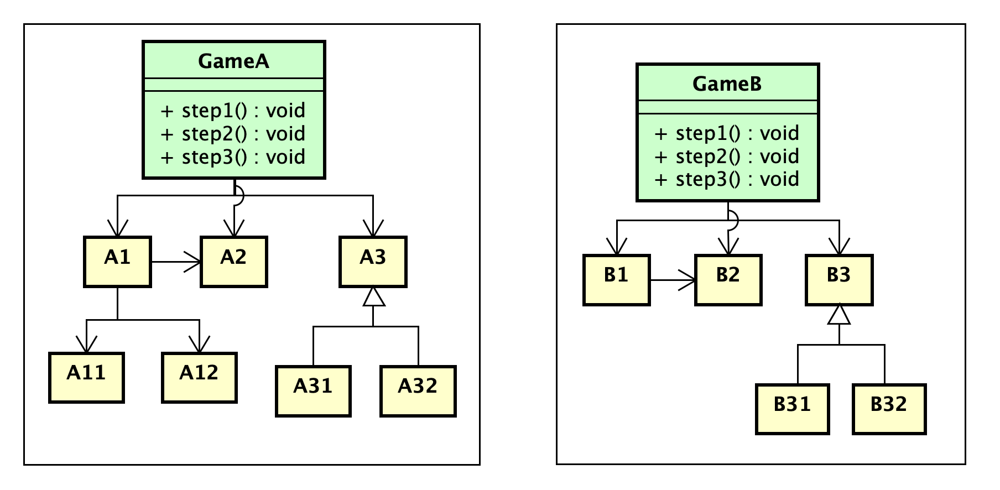
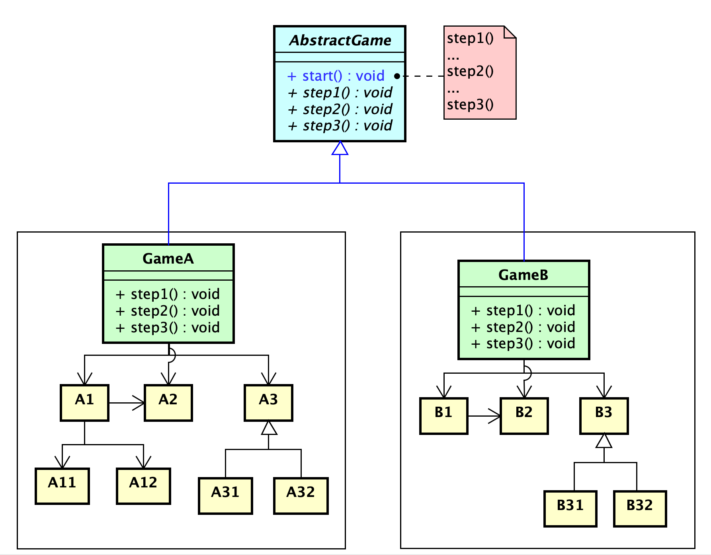
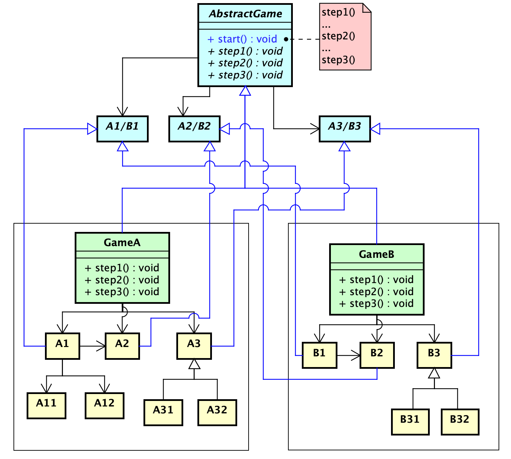

# 寫一個牌類遊戲框架！ ★★ (樣板方法——寫一個牌類遊戲框架吧)

## 需求

你要實作以下兩款簡單的牌類遊戲，而你的任務是將程式中**重複程式碼的部分減至越少越好**。

### 第一款：簡易撲克牌比大小遊戲

1. 這款遊戲能支援四位玩家：玩家可以為 _真實玩家 (Human Player)_ 也能為 _電腦玩家 (AI Player)_。
    1. 玩家的實作：
        1. 真實玩家：使用指令介面輸入 (Command Line Interface) 來做選擇。
        2. 電腦玩家：隨機做選擇。
    2. 在以下需求中：我們用 _P1, P2, P3, P4_ 來表示 _第一、二、三和第四順位的玩家_。
2. 遊戲中有一副 _牌堆 (Deck)_。
    1. 牌堆中一開始存有 52 張 _牌 (Card)_。
    2. 每張牌都會擁有 _階級 (Rank)_ 及 _花色 (Suit)_。
3. 遊戲依照以下 1~4 的流程進行：
    1. 遊戲開始時，依序執行以下：
        1. 請 P1~P4 為自己取名 (Name himself)。
        2. 牌堆會進行洗牌 (Shuffle)。
    2. **抽牌階段：** 由 P1 開始，P1~P4 輪流從牌堆中抽牌 (Draw Card)，直到所有人都擁有手牌 (Hand) 13 張牌為止。
    3. 抽完牌後，在接下來的 13 回合中，每一回合依序執行以下：
        1. P1~P4 輪流 (Takes a turn) 出 (Show) 一張牌（此步驟彼此皆無法知曉彼此出的牌）。
        2. 顯示 P1~P4 各出的牌的內容。
        3. 將 P1~P4 出的牌進行 _比大小決勝負_，將最勝者的分數(Point)加一。
    4. 13 回合後，P1~P4 皆已出完全部的牌，遊戲結束。取得最多分數的玩家為勝者，將勝者的名稱顯示出來。
4. **牌與牌之間的比大小決勝規則**：
    1. 先比較牌的階級，此時階級較大者勝，如果階級相同則比較花色，此時花色較大者勝。
    2. 階級由小到大依序為：2, 3, 4, 5, 6, 7, 8, 9, 10, J, Q, K, A
    3. 花色由小到大依序為：梅花 (Club)、菱形 (Diamond)、愛心 (Heart)、黑桃 (Spade)

### 第二款：簡易 UNO

1. 這款遊戲能支援四位玩家：玩家可以為 _真實玩家 (Human Player)_ 也能為 _電腦玩家 (AI Player)_。
    1. 玩家的實作：
        1. 真實玩家：使用指令介面輸入 (Command Line Interface) 來做選擇。
        2. 電腦玩家：隨機做選擇。
    2. 在以下需求中：我們用 _P1, P2, P3, P4_ 來表示 _第一、二、三和第四順位的玩家_。
    3. 遊戲中有一副_牌堆 (Deck)_。
        1. 每張牌都會擁有顏色 _(Color)_ 及數字 _(Number)_。
        2. 牌堆中一開始存有 40 張 _牌 (Card)_ ： **4** 種顏色 (_BLUE, RED, YELLOW, GREEN_) x 10 個數字 (_0~9_)。
    4. 遊戲依照以下 1~3 的流程進行：
        1. 遊戲開始時，依序執行以下：
            1. 請 P1~P4 為自己取名 (Name himself)。
            2. 牌堆會進行洗牌 (Shuffle)。
        2. **抽牌階段：** 由 P1 開始，P1~P4 輪流從牌堆中抽牌 (Draw Card)，直到所有人都擁有手牌 (Hand) 5 張牌為止。
        3. **遊戲執行以下流程：**
            1. 從牌堆中翻出第一張牌到檯面上。
            2. 由 P1 開始，出牌順序為 P1 → P2 → P3 → P4 → P1 以此類推。
            3. 玩家出的牌必須與檯面上最新的牌的顏色一樣，或是數字一樣。出完的牌就會成為檯面上最新的牌。
            4. 最快出完手中牌的人為遊戲的贏家。
            5. 如果玩家沒有任何可出的牌，玩家就必須從牌堆中抽一張牌，如果此時牌堆空了，則會先把檯面上除了最新的牌以外的牌放回牌堆中進行洗牌。

## 小提示

> 對於每一道挑戰題而言，各位都要珍惜「能鍛鍊自己思路」的機會。不要急於觀看我所撰寫的答案，如此一來會錯過靠自己的思路來「梳理複雜需求」的特訓機會。

「答案隨時都在這，不會長腿跑掉，但屬於你的 —— 高品質的獨立思考訓練卻可能只有一次機會。」

接下來我還不會秀出詳解，而是先秀出**小提示**。小提示幫助各位進一步了解方向，我建議各位冒險者先試著靠自己能力做物件導向分析，畫出你認為有效的類別圖，直到耗盡自身所能之後，再往下進一步參考提示。

---

### 小提示

1. 首先，由於這一道題目中同時存在 **兩份需求: 「Showdown」和「Uno」，你可以當作是兩個不同的領域 (Domain)。所以你當然可以繪製兩份類別圖（或者是只繪製一份，但透過類別圖中的Package 將兩個領域模型隔開來）。**

2. 我建議你使用 **Bottom-Up** 的方式來「重構」你的程式：樣板方法是很講究細節的模式，他關注的是「**某道行為中的『變』與『不變』之處**」。在你尚未將兩款遊戲的行為梳理到很具體的步驟，或是寫出兩份遊戲程式碼之前，你其實無法看見 **「變」與「不變」** 的地方。所以我會建議你，你先把兩份遊戲的領域類別圖 (OOA) 分析出來，接著就可以前去寫程式做開發。開發到 70% ~ 80% 之後，你應該漸漸能夠觀察兩款遊戲的 **「變」與「不變」** 之處，接著你便能夠回到類別圖來不斷地「**將不變之處往上萃取成介面或抽象**」，將「**變動之處留為子類別的實作**」，然後也能從過程中抽出樣板方法到兩款遊戲的共同父類別。

3. 你的 OOA 階段為兩款遊戲所繪製出領域類別圖可能會長得像以下這樣（**此圖只是範例，請勿過度參考！**）：

   

4. 接著，你發現兩個 Game 的行為非常相似，但又不全然相同，所以你知道要套樣板方法，並萃取出了一個 `AbstractGame`
   抽象類別，用來提取樣板方法，如下：

   

5. **但事情沒這麼簡單**，你會發現「兩款遊戲的共同之處」不只是遊戲流程，還包含了「卡牌遊戲的各個元素 —— 牌? 玩家? $\dots$ 等等」。意思就是，你提取上去的樣板方法中會依賴到卡牌遊戲的 **共同元素**，舉例來說：「洗牌/發牌」確實是樣板方法中的固定行為，可是洗牌卻會依賴到「牌堆和某種牌」，因此你還得仔細觀察 _GameA_ 區塊和 _GameB_ 區塊中的共同抽象元素，並往抽象層萃取更多抽象類別。

### 進階提示：所以萃取之後究竟會長什麼樣子？接著我就要在這個提示中，告訴你萃取後的 Form 大致上會長什麼樣子囉

以此範例為例的話，假定最後從「行為中」會發現重複性較高的類別為以下：

1. A1 和 B1 有共同概念 （舉例：Showdown 的牌堆，和 Uno 的牌堆，是共同概念）
2. A2 和 B2 有共同概念
3. A3 和 B3 有共同概念

你能從每一對類別身上萃取出抽象類別至抽象層中，最後你得到的類別圖就如同以下：

如果你使用的是強型別程式語言的話，便能**搭配使用泛型 (Generic Type) 來優化樣板方法和各步驟實作的可讀性**。
