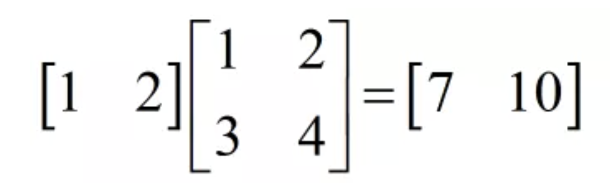
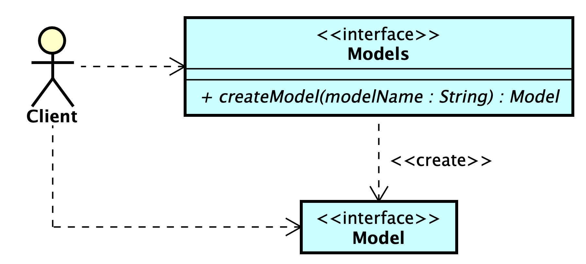

# 單體模式——計算模型

## A. 需求

1. 你要開發一個「計算模型 (Computation Model)」套件，套件中提供三種模型，分別稱之為 Reflection、Scaling、Shrinking，每一種計算能力不同。

2. 所有模型皆提供同一種計算，這種計算被稱之為「線性轉換 (Linear Transformation)」。套件的使用者將會傳入大小為 1000
   的浮點數陣列，或稱之為向量 (Vector)，模型對這個向量做某種線性轉換之後，會回傳一個新的，大小同樣為 1000
   的浮點數陣列，也被稱之為線性轉換過後的向量。

3. 這三種模型將由一個長和寬皆為 1000 的二維浮點數陣列表示，此二維浮點數陣列被稱之為矩陣 (Matrix)。

4. 我們透過以下方式定義此線性轉換的計算過程： $$f(v) = v \times m = r$$
   其中：
    - $f$ 為線性轉換函數
    - $v$ 為此函數的輸入向量：$v = (v_1, v_2, ..., v_{1000})$ (大小為 1000)
    - $m$ 為代表該模型的矩陣
    - $r$ 為輸出向量：$r = (r_1, r_2, ..., r_{1000})$ (同樣大小為 1000)

   線性轉換的計算將輸入向量 $v$ 乘上矩陣 $m$，產生輸出向量 $r$。

5. 若我們使用 $m_{i,j}$ 表示模型矩陣中第 $i$ 列且第 $j$ 欄（意即 $m[i][j]$
   ）的元素，則我們可以用以下方式來更精確地定義向量 $v$ 與矩陣 $m$ 之間的乘法：
   $$r_i = \sum_{n=1}^{1000} v_n \times m_{n,i}$$

    - 以下為一簡單的計算範例，為了簡化，將向量和矩陣的大小定為 2：

      

    - 給定向量 $v = (1,2)$ 和
      矩陣 $M = \begin{pmatrix} m_{1,1} & m_{1,2} \\ m_{2,1} & m_{2,2} \end{pmatrix} = \begin{pmatrix} 1 & 2 \\ 3 & 4 \end{pmatrix}$

    - 計算結果向量 $r$ 的元素如下：

        * 第一個元素：
          $$r_1 = v_1 \times m_{1,1} + v_2 \times m_{2,1} = 1 \times 1 + 2 \times 3 = 7$$

        * 第二個元素：
          $$r_2 = v_1 \times m_{1,2} + v_2 \times m_{2,2} = 1 \times 2 + 2 \times 4 = 10$$

      因此，最終結果向量為：$r = (7,10)$

      完整運算可表示為：
      $$
      \begin{pmatrix} 1 & 2 \end{pmatrix} \times \begin{pmatrix} 1 & 2 \\ 3 & 4 \end{pmatrix} = \begin{pmatrix} 7 & 10 \end{pmatrix}
      $$

6. 為了能夠更方便地管理模型的矩陣內容，套件的實作中將矩陣的浮點數內容透過某種格式打在一份檔案中，為每一個模型定義的矩陣檔案皆以
   `<模型名稱>.mat` 命名。Reflection 模型的矩陣會定義在 _Reflection.mat_ 檔案中、Scaling 模型的矩陣會定義在 _Scaling.mat_
   檔案中，以此類推。

7. 矩陣檔案的格式定義十分簡單：檔案中的第 iii 行紀錄著矩陣中第 iii 列的浮點數，每個浮點數之間以一個空白隔開。以下是一個大小為
   3 的矩陣檔案範例：

       1.3 2 3 
       0 0 2.78
       4.1231 0 5.829

   其中 $m_{1,1} = 1.3$, $m_{1,2} = 2$, $m_{1,3} = 3$, $m_{2,1} = 0$, $m_{2,2} = 0$, $m_{2,3} = 2.78$, $m_{3,1} = 4.1231$, $m_{3,2} = 0$, $m_{3,3} = 5.829$

8. Reflection、Scaling 和 Shrinking 三個模型的矩陣檔案為以下：

   [Reflection.mat](./Documents/Reflection.mat)

   [Scaling.mat](./Documents/Scaling.mat)

   [Shrinking.mat](./Documents/Shrinking.mat)

## B. 設計需求

此章節為「設計需求」，其中每一個子章節中會「循序漸地」添加新的需求。各位開發者可以「一次針對一個子章節」專心做好設計就好。像是先專心做好
**_B-1_ 中的設計需求**，然後接著才考慮 _B-2_ 中的設計需求，以此類推。

由於單體模式有「多種變形」，所以此章節透過循序漸地的需求，來帶你探索各式各樣的變形。雖然我在旅程景點影片中未交代清楚多種變形的實作，
**但請冒險者先盡可能透過自己的創意來發想解決方案，你一定有辦法透過自己的思考，就將每一種變形的實作設計出來**
。而我會在詳解中解釋清楚每一種變形的實作方法。

### B-1 設計需求 — v1

1. 套件的 Client 會依賴於一個 `Models` 介面的實作物件，並且呼叫此物件的 `createModel` 操作，傳入欲取得的模型名稱字串（
   _Reflection_, _Scaling_ 或是 _Shrinking_），來即時創建出此模型物件，型態為 `Model` 介面（此介面的內容自行定義）。為以下所示：

   

2. 擴充新的模型或是刪除舊有模型時，能夠完全不修改既有的程式碼，只須**新增新的矩陣檔案**即可，在模型擴充上做到最全面的
   OCP。注意，如果你在程式中分別為 _Reflection_, _Scaling_ 或是 _Shrinking_ 皆開出了一個實作類別，則違反了此項要求。

3. 希望程式設計上盡可能地節省記憶體資源的使用，並做好最完善的防範來避免 `Client` 透過某種無節制的操作來過度消耗記憶體資源。
   在此專案中最須要注意的就是要避免模型的浮點數二維陣列被重複創建出來。

4. `Models` 和 `Model` 的實作類別可自由設計，`Client` 也「可能」直接依賴於你定義的實作類別。

5. `Models` 介面 `createModel` 操作每次回傳的 `Model` 物件皆為新創建出來的模型物件。

各位冒險者可以先針對設計需求 v1 做設計，設計完成之後再前往 **_B-2_** 閱讀。

### B-2 設計需求 — v2

1. 希望套件能夠盡量延遲載入 (Lazy Loading) 系統中的每一個物件，直到真正要用到該物件/資料時才將相關資源記憶體載入至系統中。

### B-3 設計需求 — v3

1. 希望套件能在非同步的執行下依然保證設計需求 v1 和 v2 中提到要求。何謂非同步？可想像會有超過一位 Client 在程式執行時，同一時間同時依賴
   `Models` 和 `Model` 介面，並呼叫著介面上提供的操作。

如以下的虛擬程式碼所示：

    非同步執行一百圈：
        Models models = 取得 Models 的實體
        Model model = models.createModel(某一種模型名稱)
        r = model.計算(大小為 1000 的浮點數陣列) // 建議用全為 1.0 的向量測試
        印出 r
