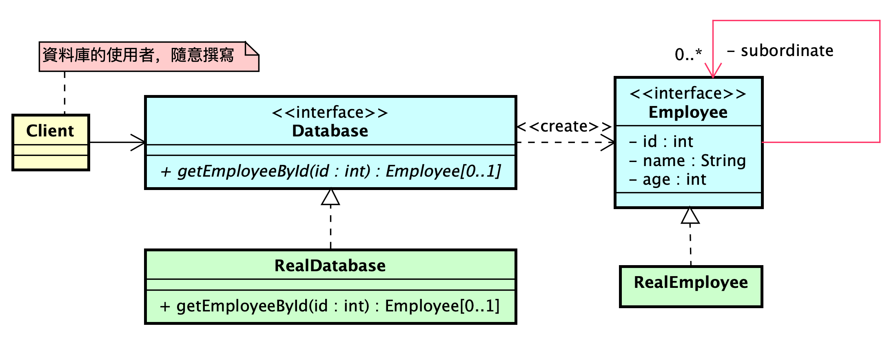

# 代理人模式——【延遲載入】員工資料表存取

## 員工資料表資料存取工具設計需求

### 一、資料表結構

您需要設計一個資料存取工具 (以下簡稱 Database) 來處理員工資料表。該資料表具有以下特性：

1. **標題列:** 資料表的第一列為標題列，定義了資料欄位的名稱和順序。
2. **資料欄位:** 資料表包含四個欄位：
    - `id`：員工唯一識別碼，為正整數。
    - `name`：員工姓名，為不包含空白字元的字串。
    - `age`：員工年齡，為正整數。
    - `subordinateIds`：該員工直接下屬的員工 ID 列表，以逗號分隔的多個數字組成。若無下屬，則為空字串。
3. **資料列:** 標題列之後的每一列代表一位員工的資料，欄位值之間以空白隔開。
4. **資料順序:** 資料表按照員工 ID (`id`) 升序排列，保證第 $i$ 列的員工 ID 為 $i-1$。例如，第二列的員工 ID 為 1，第三列的員工
   ID 為 2，以此類推。

**範例資料表:**

```
id name age subordinateIds
1 waterball 25 
2 fixiabis 15 1,3
3 fong 7 1
4 cc 18 1,2,3
5 peterchen 3 1,4
6 handsomeboy 22 1
...
``` 

### 二、Database 功能需求

`Database` 提供以下操作：

**查詢員工資料:**

- **輸入:** 員工 ID (正整數)
- **輸出:**
    - 若該員工存在於資料表中，回傳該員工的完整資料列（包含所有欄位）。
    - 若該員工不存在，回傳明確的錯誤訊息或使用特殊返回值表示查詢失敗。

## 其他說明

* 請在設計 Database 時考慮資料表的特性，以優化查詢效率。
* 請在設計 Database 時明確定義錯誤處理機制，以便使用者在查詢失敗時獲得清晰的提示。

## 員工資料表資料存取工具設計需求 - 設計階段

### 一、初始設計

設計應基於以下類別圖：



* **`Database` 介面:** 定義查詢員工資料的方法。
* **`RealDatabase` 類別:** 實際實現 `Database` 介面的類別，負責從資料表中讀取員工資料。
* **`Employee` 介面:** 定義單一員工資料的存取方法，包含獲取員工基本資訊和該員工**上下級關連**(直接下屬)。
* **`RealEmployee` 類別:** 實際儲存員工資料的類別，實現 `Employee` 介面。
* **`Client` 類別:**  Database 的使用者，可以根據需求呼叫 Database 的方法獲取員工資料。

### 二、擴充設計需求

在不修改初始設計 (圖表中的類別和介面) 的前提下，滿足以下設計需求：

1. **避免記憶體不足 (Out Of Memory Prevention):**  `RealDatabase` 不應**一次性**將所有員工資料載入記憶體，而是在 `Client`
   要讀特定一筆員工資料時，僅載入該員工的資料紀錄(row)即可。
2. **延遲載入 (Lazy Initialization):**  員工的直接下屬資訊 (`Employee` 物件) 應在 `Client` 呼叫
   `employee.getSubordinates()` 方法時才進行載入。
3. **密碼保護 (Password Protection):**  在 `RealDatabase` 的 `getEmployeeId` 操作執行前，必須檢查環境變數 `PASSWORD`
   的值是否為 `1qaz2wsx`，只有在驗證通過後才能繼續執行資料庫操作，否則中斷操作並拋出錯誤。

### 三、設計說明

為滿足上述需求，可以考慮以下設計方案：

1. **避免記憶體不足:**
    * `RealDatabase` 可以使用檔案流 (File Stream) 或資料庫連線 (Database Connection)  讀取資料表，每次只載入單一員工資料到記憶體。
2. **延遲載入:**
    * 在 `RealEmployee` 類別中，使用一個容器 (例如：`List<Employee>`) 儲存直接下屬的 `Employee` 物件。
    * 初始時，該容器為空或僅儲存下屬員工 ID。
    * 當 `getSubordinates()` 方法被呼叫時，檢查容器是否已載入下屬 `Employee` 物件，若未載入，則根據下屬員工 ID 從
      `RealDatabase` 中載入對應的 `Employee` 物件。
3. **密碼保護:**
    * 在 `RealDatabase` 的 `getEmployeeId` 方法中，添加環境變數 `PASSWORD` 的驗證邏輯。
    * 可以使用 Java 提供的 `System.getenv()` 方法讀取環境變數。
    * 若驗證失敗，則拋出異常或返回錯誤訊息，中斷資料庫操作。

### 四、注意事項

+ 設計應盡可能減少類別之間的耦合性，例如，`Employee` 類別不應直接依賴 `RealDatabase` 類別。
+ 應妥善處理異常情況，例如，環境變數不存在或值不正確的情況。

