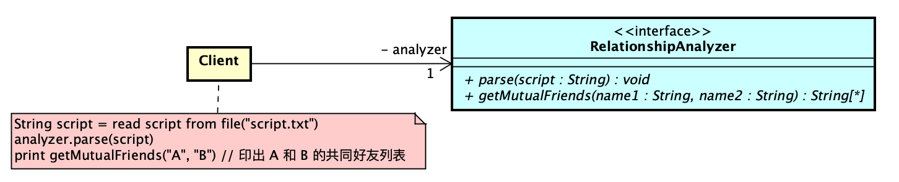
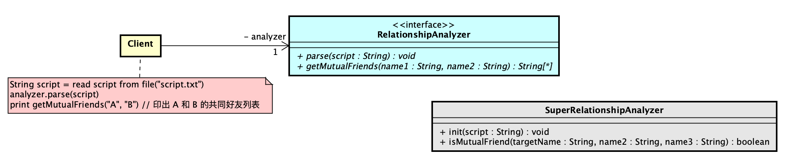
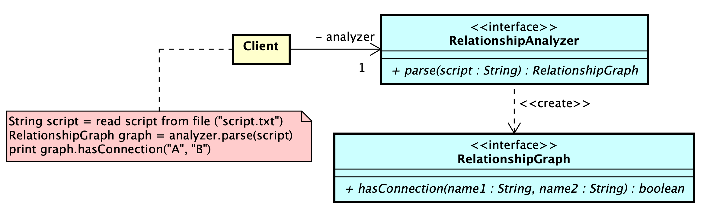

# 轉接器模式——好友關係分析器(FriendshipAnalyzer)

## A. 需求

在當今社群平台盛行的時代，人們透過平台上的好友功能，與彼此建立連結。本專案旨在開發一套簡易的「好友關係分析器」，用以分析社群平台上的好友關係。
分析器將採用特定的指令稿 (Script) 格式來描述使用者之間的好友關係。使用者可以使用此格式撰寫指令稿，並將其輸入分析器，以便進行關係分析。

1. 本專案的第一階段將著重於基礎功能的開發。在使用者輸入指令稿後，分析器將能接受兩個使用者名字 (name)
   作為輸入，並查詢兩者之間的所有共同好友 (Mutual Friends)。
    1. 共同好友的定義如下：$C$ 為 $A$ 和 $B$ 的共同好友，若且唯若 $A$ 和 $C$ 是好友，且 $C$  和 $B$ 也是好友。

## B. 設計需求

1. 你和同事小華共同負責開發此專案。小華在理解需求後，決定著手「好友關係分析器具體實作類別」的開發，並將其他部分留給你負責。

2. 在小華完成「好友關係分析器具體實作類別」之前，你需要先定義一個介面，用以表達「分析好友關係」的概念。

    1. 你設計的第一版物件導向分析圖如下所示：
       
    2. `RelationshipAnalyzer` 介面中的 `parse` 操作負責接收一個關係指令稿字串，該字串必須符合以下格式：每行的開頭為
       `<使用者名稱>:` ，代表該行描述的是該使用者的朋友清單 `:` 冒號後空一格，接著是 0 個或多 (0..*) 個使用者名稱(name)
       ，代表該使用者的所有好友。

        ```plaintext
       A: B C D
       B: A D E
       C: A E G K M
       D: A B K P
       E: B C J K L
       F: Z
       ...
3. `RelationshipAnalyzer` 在完成關係指令稿解析後，可以透過 `getMutualFriends`
   操作取得兩個使用者之間的所有共同好友。呼叫此操作時，需要傳入兩個使用者名稱 (`name1` 和 `name2`)
   作為參數，並將回傳一個包含所有共同好友的列表（順序不限）。
4. `Client` 類別的行為如類別圖下方的便條紙所示：首先從一個純文字檔案中讀取完整的關係指令稿字串，然後將其傳遞給
   `RelationshipAnalyzer` 的 `parse` 操作進行解析；接著，呼叫 `RelationshipAnalyzer` 的 `getMutualFriends`
   操作，並將取得的共同好友列表輸出出來。

## C. 設計需求（整合小華類別）

在你完成基於 `RelationshipAnalyzer` 介面的 Client 程式後，小華也完成了「好友關係分析器具體實作類別」的開發。

1. 整合小華的類別後，類別圖如下所示：

    1. 小華新增了一個名為 `SuperRelationshipAnalyzer` 的類別。

       

    2. `SuperRelationshipAnalyzer` 類別中的 `init` 操作接收一個關係指令稿字串，但該字串的格式與需求 B-2-B
       中定義的不同。其格式如下所示：每行的格式為 `<使用者名稱1> -- <使用者名稱2>` ，表示使用者名稱 1 和使用者名稱 2 互為好友。

         ```plaintext
         A -- B
         A -- C
         A -- D
         B -- D
         B -- E
         C -- E
         C -- G
         C -- K
         C -- M
         D -- K
         D -- P
         E -- J
         E -- K
         E -- L
         F -- Z
         ...
         ````
    3. 在 `SuperRelationshipAnalyzer` 完成關係指令稿初始化後，可以透過呼叫 `isMutualFriend`
       操作來判斷某個使用者是否為另外兩個使用者的共同好友。呼叫此操作時，需要傳入三個使用者名稱 (`targetName`, `name1` 和
       `name2`) 作為參數，並根據回傳值判斷 `targetName` 是否為 `name1` 和 `name2` 的共同好友（`true` 表示是，`false` 表示否）。
    4. 在不修改 Client, `RelationshipAnalyzer` 和 `SuperRelationshipAnalyzer` 任何程式碼的前提下，請整合
       `SuperRelationshipAnalyzer` 來實現 Client 的功能需求。

## 進階挑戰題

### A2. 進階需求

1. 延續 A
   章節的需求，新增一項功能：在將指令稿載入分析器後，使用者可以輸入兩個使用者名稱，讓分析器判斷這兩個使用者是否存在「連結」(
   Connection)。
    1. 連結的定義如下：若使用者 A 與使用者 B 之間存在連結，則表示存在一串使用者 $A, x_1, x_2, ..., x_n, B$，其中 A 與 $x_1$
       互為好友，$x_n$ 與 B 互為好友，且所有 $x_i$ 和 $x_{i+1}$ 皆互為好友 ($i = 1, 2, ..., n-1$)。
        1. 舉例說明：假設小明和小美是好友，小美和小玉是好友，小玉和小華是好友，則小明和小華之間存在連結。由於好友關係是雙向的，因此小華和小明之間也存在連結。依此類推，小明、小美、小玉和小華彼此之間都存在連結。

### B2. 進階設計需求

你仍然需要先定義一個介面來表達「分析好友關係」的概念。然而，為了應對進階挑戰題中分析使用者之間連結性的需求，以及未來可能新增的其他功能，你決定調整介面的使用方式，以便更好地滿足這些複雜的需求。

1. 你設計的第一版物件導向分析圖如下所示：
   

2. `RelationshipAnalyzer` 介面中的 `parse` 操作仍然接收一個關係指令稿字串，且該字串的格式與需求 B-2-B
   中描述的格式完全相同。不同的是，在進階設計需求中， `parse` 操作在完成關係指令搞解析後，會直接回傳一個
   `RelationshipGraph`
   物件，使用上更加方便。

3. `RelationshipGraph` 介面中只有一個操作 `hasConnection` ，該操作接收兩個使用者名稱 (`name1` 和 `name2`)
   作為參數，並回傳這兩個使用者是否存在連結（`true`
   表示存在，`false` 表示不存在）。

4. Client 類別的行為如類別圖下方的便條紙所示：首先從一個純文字檔案中讀取完整的關係指令稿字串，然後將其傳遞給
   `RelationshipAnalyzer` 的 `parse`
   操作進行解析，並取得一個 `RelationshipGraph` 物件；接著，呼叫 `RelationshipGraph` 的 `hasConnection`
   操作，並根據回傳值判斷並顯示兩個使用者之間是否存在連結。

5. 在不修改 Client, `RelationshipAnalyzer` 和 `RelationshipGraph` 任何程式碼的前提下，請整合第三方圖論套件來實現 Client
   的功能需求。

    - 功能需求 A2-1-A 涉及圖論中的連通性分析 (connectivity analysis)。請搜尋你使用的程式語言中是否有支援連通性分析等功能的第三方圖論套件，並將其整合到你的程式碼中。


