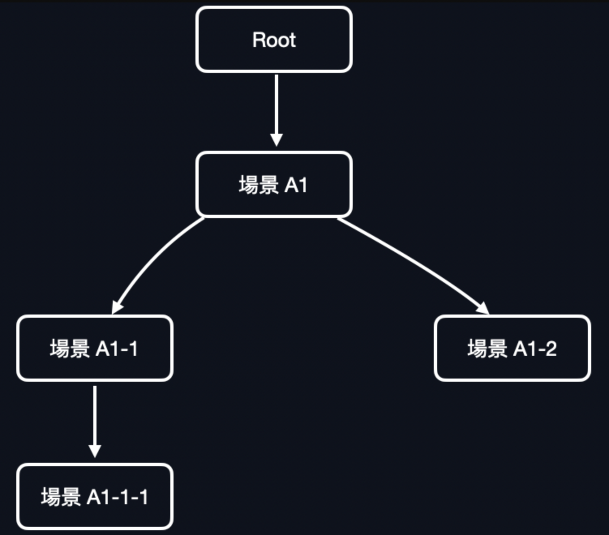
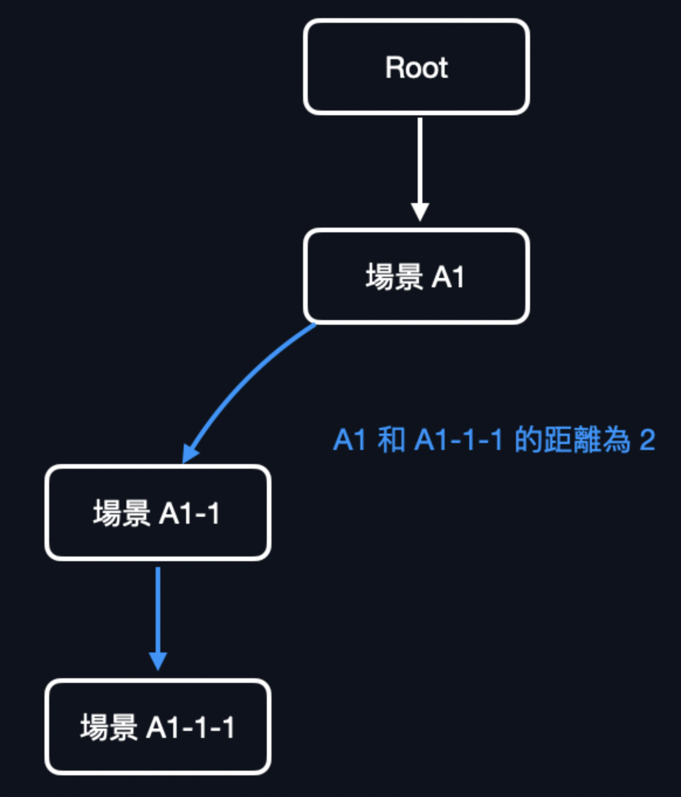

# C5 魔王題 ★★★★：命令行程式控制反轉框架

## A. **單字學習系統 (Vocabulary Learning System)**

- 你要開發一個「**單字學習系統 (Vocabulary Learning System)**」，這個系統的功能架構如以下所示：
    1. **管理單字 (Manage words)**：讓使用者能管理自己的單字庫中的單字。
        1. **查詢單字 (Search words)**
           ：輸入一個單字，系統上網幫忙查詢單字定義，並印出。使用者也能在此時決定將此單字加入單字庫 (Word Repository) 中。
        2. **新增單字 (Add new words)**：輸入一系列單字，系統上網幫忙查詢這一系列單字，並將查詢成功的單字加入單字庫中。
        3. **刪除單字 (Delete words)**：輸入一系列單字，系統從單字庫中尋找這些單字，並將他們刪除。
    2. **複習單字 (Review words)**：
- 資料解釋：
    1. **單字 (Word)**：
        1. 名單 (Name)：由一到多個字母組成，允許橫字符`-` 和空白。
        2. 描述 (Description)：每個單字都具備至少一個的描述，描述為簡單易懂的文字。
        3. 定義 (Definition)：每個單字都具備至少一項定義，定義由「詞性 (part of speech)」和其單字在此詞性下的定義解釋組成。
            - 詞性 (Part of speech, PoS)：每個詞性都有其縮寫和全名。以下列出可能的詞性，以及其縮寫：
                1. 名詞 Noun (n.)
                2. 動詞 Verb (v.)
                3. 形容詞 Adjective (a.)
                4. 副詞 Adverb (adv.)
    2. 以 `present` 作為範例， `present` 會有以下欄位：
        - 描述 (Description)：The period of time now occurring.
        - 定義（Definitions）：
            - noun: The period of time now occurring.
            - verb: Give something to (someone) formally or ceremonially.
            - adjective: Existing or occurring now.

## A-1 CLI 場景/使用案例描述

此章節針對每一項功能使用案例，釐清使用者與系統真實的交互使用案例。

### A-CLI 場景畫面結構解釋

1. 為了方便使用者操作和易讀，整體 CLI 系統的畫面將維持一致的結構，從上到下分別為四個部分：

    1. **麵包屑 (Breadcrumbs)**：用於顯示使用者當前正在操作的場景 (Scene)，以及畫面所屬的階層，讓使用者知道上一頁和上上頁為何。如顯示：
       `/ A / B / C` ，代表使用者目前正在 C 畫面，而上一頁為 B 畫面，上上頁為 A 畫面且 A 畫面。
    2. **訊息顯示窗 (Messenger)**：CLI 系統主要顯示訊息 (Message) 的部分。
    3. **選單 (Menu)**：指引使用者如何輸入指令來前往其他畫面的導覽。由多列組成，每一列為一個選單選項 (Menu Option)，選項顯示為：
       `[$code]: $goal` ，其中 `$command` 為使用者須下達的指令，而 `$goal` 為下達此指令（所有字元須完整匹配）後會前往的畫面或是欲執行的系統行為。
    4. **最下面的部分為使用者輸入提示攔 (Prompt)**：輸入攔中顯示訊息來提示使用者須輸入何種訊息。
2. 每一個部分之間都會以三個橫字符作為分隔線區隔開來，所以整體畫面大致上會長得像這樣：

       $Breadcrumbs
       ---
       $Messenger
       ---
       $Menu
       ---
       $Prompt

3. `$Messenger` 區塊可有可無，如果該頁面無 Messenger 區塊的話，會顯示為以下格式：

       $Breadcrumbs
       ---
       $Menu
       ---
       $Prompt

### A0 場景共同行為規範

此項目中陳列所有使用案例下的共同行為。

1. 所有使用者的輸入的指令判讀**都不區分大小寫**。
2. 不管使用者在哪一頁，選單中最後一列的選項永遠都是 `[\ESC]: Exit` ，代表無論在何時，只要使用者輸入 `\ESC`
   （不區分大小寫），系統就會立即結束。
3. 大多數時候（視場景設計），選單的**倒數第二列**會是 `[\B]: Previous Page` ，只要此畫面中存在此菜單列，就代表使用者此時可以輸入
   `\B` ，來結束當前畫面，並回到上一頁。
4. 在以下使用案例描述中，將會一律使用 `<>` 括號來表示接收使用者輸入的位置，括號內的名稱則為使用者輸入的參數名稱。
5. 如果使用者的輸入不匹配任何的選單選項，並且在該場景下也未有任何作用，或甚至是不合法，則場景畫面會直接刷新（不必顯示任何錯誤訊息）。

### A1 主頁面 (Home page)

1. 系統印出主頁面，主頁面中列出支援的子場景(Manage words & Review words)：

    ```
   /
   ---
   Hello, welcome to vocabulary learning system.
   ---
   [/1] Manage words
   [/2] Review words
   [/B] Previous Page
   [/ESC] Exit
   ---
   What are you looking for?
   <input>
   ```


1. 使用者輸入欲使用的功能：
    1. 若輸入 `/1` 則系統會前往 \[A11\] Manage words 場景。
        1. 系統印出 Manage words 場景，並列出支援的子場景(Search words & Add new words & Delete words)：

           ```
           / Manage words
           ---
           Wanna learn a new word?
           ---
           [/1] Search words
           [/2] Add new words
           [/3] Delete words
           [/B] Previous Page
           [/ESC] Exit
           ---
           Hello, please select a place to go:
           <input>
           ```
       
        2.  使用者此時輸入 `/1` 則會前往場景 A1-1、`/2` 則會前往場景 A1-2、`/3` 則會前往場景 A1-3。
            
    2.  若輸入 `/2` 則系統會前往 \[A2\] Review words 場景 。

### A11 管理單字 (Manage Words)

1. 場景畫面為以下：

   ```
   / Manage words
   ---
   Wanna learn a new word?
   ---
   [/1] Search words
   [/2] Add new words
   [/3] Delete words
   [/B] Previous Page
   [/ESC] Exit
   ---
   Hello, please select a place to go:
   <input>
   ```

2. 使用者此時輸入 `/1` 則會前往場景 A111、`/2` 則會前往場景 A112、`/3` 則會前往場景 A113。

### A111 **查詢單字 (Search words)**

1. 系統印出激勵訊息，並且在 prompt 中請使用者輸入一個單字名稱。

   ```
   / Manage words / Search words
   ---
   Genius is one percent inspiration and ninety-nine percent perspiration.
   ---
   [/B] Previous Page
   [/ESC] Exit
   ---
   Please input a word's name:
   <$name>
   ```
2. 使用者輸入一行 `$name`，作為欲查詢的單字名稱。

3. 系統透過某種技術手段 \[B1\]，來查詢該單字的完整解釋和定義，分成兩種情況 (1) 有查詢到該單字 (2) 無法查詢到該單字：

    1. 有查詢到該單字：
        1. 在 messenger 中印出該單字的名稱 `$name`、描述 `$description` 和所有定義 `$definitions`。

        2. 同時在選單中的第一列提供「將此單字加入單字庫」選項 **`[\1]: Add $name into word repository`**

           ```
           / Manage words / Search words
           ----
           Word: $name
           Description: $description
           $definitions
           ----
           **[\1]: Add** $name **into word repository**
           [\B]: Previous Page
           [\ESC]: Exit
           ---
           Command:
           <input>
           ```
            -   其中 `$definitions` 為多行文字，每一行的格式為 `$pos - $explaination`：
                -   `$pos` ：該單字的詞性
                -   `$explaination`：該單字在此詞性下的定義解釋
            -   若此時使用者輸入 `\1` ，則會進入到 \[A1111\] 將此單字新增至單字庫場景，為以下：
                1.  系統將此單字加入單字庫，並印出操作結果訊息：
                     
                    ```
                    / Manage words / Search words / **Add '**$name**' into word repository**
                    ----
                    The word '$name' has been added.
                    ----
                    [*]: Okay, I got it
                    [\ESC]: Exit
                    ---
                    Command:
                    <input>
                    ```
                    
                2.  此時使用者輸入任意一到多個字元，則可以結束此 \[A1111\] 場景，回到步驟 1。
                    
    2.  無法查詢到該單字：
        1.  在 messenger 中印出「無法查詢到該單字」等訊息：
            
            ```
            / Manage words / Search words
            ---
            Cannot find the word '$name'.
            ---
            [/B] Previous Page
            [/ESC] Exit
            ---
            Please input a word's name:
            <$name>
            ```

        2.  此時回到步驟 2，等待使用者輸入一行單字名稱。

### A112 新增一組單字

1. 系統印出訊息，請使用者以逗號（逗號前後可以有空白）隔開來輸入多個單字：

   ```
   / Manage words / Add new words
   ---
   $currentWords
   ---
   [/B] Previous Page
   [/ESC] Exit
   ---
   Please input word's names (separated by commas) that you want to add:
   <$words>
   ```
    -   `$currentWords` 分為兩種情況顯示：
        -   如果單字庫中不存在任何單字：顯示 `You don't have any words.`
        -   如果單字庫中存在單字：顯示 `Current Words: $existingWords` ，`$existingWords` 為多個單字以逗號和一個空白分隔（如：`apple, banana, guava`)。

2. 使用者輸入一行訊息 `$words`，代表欲新增的單字有哪些。`$words`用逗號（逗號前後可以有空白）來隔開每一個單字名稱。（範例：輸入
   `apple, banana , people` ，會解析出三個單字 apple, banana 和 people。）

3. 系統依輸入單字的順序，使用某種技術手段 \[B-1\] 查詢該單字，將所有成功查詢到的單字加入單字庫，而將所有查詢失敗的單字顯示出來：

   ```
   / Manage words / Add new words
   ---
   $currentWords
   $wordsAdded
   $wordsNotFound
   ---
   [/B] Previous Page
   [/ESC] Exit
   ---
   Please input word's names (separated by commas) that you want to add:
   <$words>
   ```

    -   `$currentWords` 的格式為 `Current Words: $existingWords` ，`$existingWords` 為多個單字以逗號和一個空白分隔（如：`apple, banana, guava`)。
    -   `$wordsAdded` 的格式為 `Words successfully added: $words` ，`$words` 為多個已成功加入的單字，以逗號和一個空白分隔（如：`apple, banana, guava`)。
    -   `$wordsNotFound` 的格式為 `Words not found: $words` ，`$words` 為多個查詢失敗的單字，以逗號和一個空白分隔（如：`apple, banana, guava`)。
    -   `$wordsAdded` 和 `$wordsNotFound` 單字名稱印出的順序如同在第二步時輸入的順序。

4. 使用者可以在此時繼續第二步，也能執行其他操作（如回上一頁）。

### A113 刪除一組單字

1. 系統印出訊息，請使用者以逗號（逗號前後可以有空白）隔開來輸入多個單字：

   ```
    / Manage words / Delete words
    ---
    $currentWords
    ---
    [/B] Previous Page
    [/ESC] Exit
    ---
    Please input word's names (separated by commas) that you want to delete:
    <$words>
   ```

    -   `$currentWords` 分為兩種情況顯示：
        -   如果單字庫中不存在任何單字：顯示 `You don't have any words.`
        -   如果單字庫中存在單字：顯示 `Words not found: $words` ，`$existingWords` 為多個單字以逗號和一個空白分隔（如：`apple, banana, guava`)。

2. 使用者輸入一行訊息 `$words`，代表欲刪除的單字有哪些。`$words`用逗號（逗號前後可以有空白）來隔開每一個單字名稱。（範例：輸入
   `apple, banana , people` ，會解析出三個單字 apple, banana 和 people。）

3. 系統依輸入單字的順序，使用某種爬蟲手段 \[B1\] 查詢該單字，將所有成功查詢到的單字加入單字庫，而將所有查詢失敗的單字顯示出來：

   ```
   / Manage words / Delete words
   ---
   $currentWords
   $wordsDeleted
   $wordNotFound
   ---
   [/B] Previous Page
   [/ESC] Exit
   ---
   Please input word's names (separated by commas) that you want to delete:
   <input>
   ```

    -   `$currentWords` 的格式為 `Current Words: $words` ，`$words` 為多個單字以逗號和一個空白分隔（如：`apple, banana, guava`)。
    -   `$wordsDeleted` 的格式為 `Words successfully deleted: $words` ，`$words` 為多個已成功刪除的單字，以逗號和一個空白分隔（如：`apple, banana, guava`)。
    -   `$wordNotFound` 的格式為 `Words not found: $words` ，`$words` 為多個查詢失敗的單字，以逗號和一個空白分隔（如：`apple, banana, guava`)。
    -   `$wordsDeleted` 和 `$wordNotFound` 單字名稱印出的順序如同在第二步時輸入的順序。

4. 使用者可以在此時繼續第二步，也能執行其他操作（如回上一頁）。

### A2 複習單字

1. 系統印出：

   ```
   / Review words
   ---
   $greeting
   ---
   [Y]: Let's do it.
   [N]: No, not today.
   [/ESC] Exit
   ---
   Answer**:
   <$answer>**
   ```

    1.  `$greeting` 分成兩種情況：
        1.  如果單字庫中沒有任何單字，則直接顯示：`You don't have any words.`
            
        2.  如果單字庫中有單字：`$greeting` 的格式為：
            
            ```
            Are you ready for the review test?
            Latest point: $latestPoint/$latestNumOfQuestions
            ``` 
            
            1.  `$latestPoint` 為上一次複習時得到的分數
            2.  `$latestNumOfQuestions` 為上一次複習時的總分
            3.  **範例：**
            
                ```
                Are you ready for the review test?
                Latest point: 8/10
                ```    

2. 使用者輸入 `Y` 的話就前往第 3 步，輸入 `N` 則返回上一頁。

3. 使用者確定要開始複習考試後，首先先從單字庫中隨機選擇 10 個單字（若單字庫中不足 10 個單字，則取至單字數量即可），這 10
   個字為抽考範圍，針對每一題，會使用 \[A21\] 考試出題場景來幫助使用者複習。

### A21 考試出題

1. 系統針對每一個抽考單字，使用以下格式出題：
    1. 首先先從單字庫中隨機選擇 10 個單字（若單字庫中不足 10 個單字，則取至單字數量即可），這 10
       個字為抽考範圍。針對每一個抽考單字，依序使用以下格式來出題：`$questionNumber. Question: $wordBlank: $definition` 。

        1. `$questionNumber`：為該問題的編號。（從 1 開始算，第一題為 1，第二題為 2，以此類推）

        2. `$wordBlank` ：抽考單字的挖空顯示。把該單字拼寫中的 70% （無條件捨去小數點）個字母挖空。舉例來說：若單字為 apple，
           apple 的字母長度為 5 ，挖空的字母數量則為 5 x 70% = 3.5，3.5 無條件捨去為 3，代表挖空的字母數量為 3 位，挖空後的結果為
           `a___e` 。若單字為 banana，字母長度為 6，則挖空數量為 6 x 70% = 4.2，代表挖空的字母數量為 4，挖空後的結果為
           `b____a` 。

        3. `$definition`為該抽考單字隨機一詞性下的定義，作為該單字的提示。

        4. **舉例**：以下是單字 `stand` 的考題：
           `1. Question: s___d: Have or maintain an upright position, supported by one's feet.`

        5. 綜括以上，抽考單字時的畫面為以下：

           ```
           / Review words / Question $questionNumber
           ---
           Point: $point
           Remaining: $remainingQuestions
           ---
           [/B] Previous Page
           [/ESC] Exit
           ---
           $questionNumber. Question: $wordBlank: $definition
           Answer**:**
           <$userAnswer>
           ```

            -   在 messenger 中顯示分數和剩餘分數，並在 prompt 中顯示題目。
            -   `$point` 為目前使用者在本次複習考試中，已獲得的分數，在每場複習考試中的初始分數為 0。
            -   `$remaining` 為本次複習考試，剩下多少道題目。
    2.  當使用者輸入完答案 `$userAnswer` 之後，接著判斷是否回答正確，如果回答正確則 `$point` 會加一分，否則分數不變。
        
    3.  接著呈現「答題結果畫面」：
        
        ```
        / Review words / Result
        ---
        $result
        ---
        [/*] Continue
        [/ESC] Exit
        ---
        Command:
        <$input>
        ```

        1.  將結果呈現在在 messenger 之中，`$result` 有兩種情況，分別為答對和答錯：
            1.  答對：`You got the answer. The answer is $answer.`
            2.  答錯：`You missed it! The answer is $answer.`
            3.  `$answer` 為本次所答題目的正確答案（單字拼寫）。
        2.  此時使用者可以輸入任意指令（除了 `/ESC` ）來繼續下一題。輸入完任意指令之後，接下來會出下一題，並回至步驟 3。

## B1 某種「查詢單字定義」的手段

1. 由於需求包含「查詢單字定義」等功能，你需要提供一些技術上的查詢手段，預設請你先提供一版「本地查詢單字」的實作：這項實作中會在每一次查詢單字時，都從一份
   json 檔案中讀取單字。
    1. Json 檔案中的格式如下：

       ```
       {
         "<單字名稱>": {
           "description": "<單字解釋>",
             "definitions": {
               "<詞性>": "<單字在該詞性下的解釋>",
               ...
             }
           },
               ...
       }
       ```

        -   **範例：**
        
            ```
            {
              "light": {
                "description": "The natural agent that stimulates sight and makes things visible",
                "definitions": {
                  "noun": "The natural agent that stimulates sight and makes things visible.",
                  "verb": "To provide with light or lighting; illuminate.",
                  "adjective": "Having a considerable or sufficient amount of natural light; not dark."
                }
              },
              "lead": {
                "description": "Cause a person or animal to go with one by holding them by the hand, halter, rope, etc. while moving forward",
                "definitions": {
                  "verb": "Cause (a person or animal) to go with one by holding them by the hand, a halter, a rope, etc. while moving forward.",
                  "noun": "The initiative in an action; an example for others to follow."
                }
              },
              ...
            }
            ```
            
        -   在此範例中，當使用者查詢單字 `light` 時，會查詢成功並且從檔案中讀出 light 的解釋和定義。而當使用者查詢單字 `apple` 時，會查詢失敗。

2. 未來有可能會想提供不同技術實作，好比會想要擴充「爬蟲」手段的技術實作：當使用者查詢單字時，會透過爬蟲套件來載入某些字典網頁，並在網頁中透過爬蟲解析器將單字解釋和定義解析到程式記憶體當中。

## B2 場景生命週期設定

1. 此項補充每一個場景的生命週期設定，首先先定義何謂「場景的生命週期」：

    1. 場景的生命週期主要指的是：「該場景狀態的保存時間」。
    2. 好比在 「\[A112\] 新增一組單字」中，當使用者輸入欲新增的一組單字後，場景畫面會更新成「新增單字的結果」。此「新增單字的結果」即為該場景的新狀態。若此時使用者輸入
       `/b` ，則會返回到上一頁 \[A11\]，那此時問題就來了，\[A112\] 場景的狀態是否要保存呢？如果設定是「即便退回上一頁也要保存」，那麼當使用者從
       \[A11\] 再次導覽回 \[A112\] 時，應該要看見「新增單字的結果」仍存在於畫面當中。如果設定為「一離開場景就立刻清除狀態」，那麼當使用者再次從
       \[A1\] 導覽回 \[A112\] 時，則 \[A112\] 便不會顯示上次新增單字的結果，而是告知使用者目前單字庫裡有哪些單字，就像使用者首次進入
       \[A112\] 似的。
2. 為求方便解釋，以下圖為例來補充一些名詞解釋：

   

    1. 附圖為一命令行程式的「場景導覽路徑圖 (Scene navigation graph)」。

    2. **根場景（Root Scene)**：為命令行程式執行時，首要執行的場景。在此附圖範例中，根場景為 Root。

    3. **上/下層場景 (Previous/Next Scene)**：若使用者能從某 A 場景導覽至某 B 場景，我們便會說 A 為 B 的上層場景，並且 B 為
       A 的下層場景（上/下是相對的）。在此附圖範例中，Root 為 A1 的上層場景，代表使用者能從 Root 場景導覽到 A1 場景。除此之外，A1
       為 A1-1 和 A1-2 的上層場景，A1-1 為 A1-1-1 的上層場景。

    4. **場景距離**：給定任意場景導覽路徑，指定路徑上的任兩個場景便可以算出兩者之間的距離。此距離為兩者之間的導覽次數。以附圖舉例來說：給定導覽路徑
       Root → A1 → A1-1 → A1-1-1，A1 和 A1-1-1 兩者之間的距離為 2、 Root 和 A1-1-1 之間的距離為 3、A1 和 A1-1 之間的距離為
       1。

       

    5. 即使兩個場景之間的距離不為 1，也仍構成上下層關係。以附圖舉例來說：你可以說 Root 為 A1-1-1 的上層場景，即使兩者之間的距離不只為
       1，或者說 A1 為 A1-1-1 的上層關係、A1-1-1 為 Root 的下層關係。

3. 初版實作主要提供三種生命週期設定：

    1. **永遠不清空**：此場景一旦被載入，其狀態會一直保留直到程式執行結束。
    2. **離開即清空**：只要從該場景離開（無論是導覽到下層場景還是回到上層場景），都要清空該場景的所有狀態。
    3. **以「距離」作設定**：給定某一場景 _A_，和設定的生命週期距離 _D_，只有當使用者「回到」與 A 距離為 D 的「上層場景」時，才會清空
       A 場景的所有狀態。
        1. **舉例來說**，若設定距離為 2，並假設使用者目前所在場景為 A1-1，當使用者從 A1-1 回到 A1 時，會保留 A1-1
           的狀態，只有當使用者接著從 A1 回到 Root 時，由於 Root 為與 A1-1 距離為 2 的上層場景，當回到 Root 時， 便清空 A1-1
           的所有狀態。
4. 初版實作中為每一個場景提供的生命週期設定：

    1. A1 主頁面為根場景：永遠不清空
    2. A11 管理單字場景：永遠不清空
    3. A111 查詢單字場景：離開即清空
    4. A1111 將此單字新增至單字庫場景：離開即清空
    5. A112 新增一組單字場景：以距離作設定，且距離為 2。
    6. A113 刪除一組單字場景：以距離作設定，且距離為 2。
    7. A2 複習單字場景：離開即清空
    8. A21 考試出題：以距離作設定，且距離為 3。

## 設計需求

1. 抽換「查詢單字定義」的技術手段 or 套件 \[B1\] 時，能夠完全不修改既有單字複習系統領域模型、各場景和 IoC 框架的實作程式碼。

2. 你要實作一個「**命令行程式場景控制框架 (Command-line interface scene control framework)**」，這個框架能夠幫助做到以下幾件事：

    1. 開發者能以「最少重複的程式碼」來實現 \[A\] 單字學習系統完整需求，並能兼顧實現 \[B1\] 和 \[B2\] 設計需求。

        1. 每一個場景之間皆有許多重複邏輯，好比 `$Breadcrumbs`, `$Messenger,` `$Menu`, `$Prompt`
           等顯示畫面的程式邏輯、場景之間導覽的邏輯和場景生命週期等邏輯，如果要去除場景類別之間的重複程式碼，則框架必須提供共用的樣板程式，如同我們在「樣板方法」挑戰題中所受到的訓練。
    2. 開發者能以「最有可讀性、維護性」的方式，任意設計「場景導覽路徑圖 (Scene navigation graph)
       」，並且在修改此場景導覽路徑圖時，能不必修改既有的框架程式碼。好比以此需求 \[A\] 作為範例，未來若希望能在 Manage words
       場景下支援新的下層場景「Export words」時（見底下畫面）能完全不必修改 Manage words 的程式碼，更不必修改整份框架的程式碼就能做到。

       ```
       / Manage words
       ---
       Wanna learn a new word?
       ---
       [/1] Search words
       [/2] Add new words
       [/3] Delete words
       [/4] Export words // 擴充的下層場景
       [/B] Previous Page
       [/ESC] Exit
       ---
       Hello, please select a place to go:
       <input>
       ```

3. 開發者在開發單字複習系統 CLI App 時，能夠善用 IoC 框架來減少化重複的工作，所以能夠撰寫最少且不重複的程式碼就能實現 CLI
   App。好比開發者無需在每一個場景下都親自實作 Breadcrumbs,Breadcrumbs,Breadcrumbs,Messenger, Menu,Menu,Menu,Prompt
   的畫面顯示工作。

## 範例輸入

```
/1
/2
light, apple, stand, people, work
a,b,c,d,
point, change
/b
/3
light, a, b, c
stand, work, change
a, b, c, d
point
ok
/b
/esc
```

## 範例輸出入

以下腳本中記載著範例的輸入和輸出，其中輸入的部分會以冒號作為開頭。（將輸入和輸出整合呈現，你會比較容易看懂。）

```
/
---
Hello, welcome to vocabulary learning system.
---
[/1] Manage words
[/2] Review words
[/B] Previous Page
[/ESC] Exit
---
What are you looking for?
:/1
/ Manage words
---
Wanna learn a new word?
---
[/1] Search words
[/2] Add new words
[/3] Delete words
[/B] Previous Page
[/ESC] Exit
---
Hello, please select a place to go:
:/2
/ Manage words / Add new words
---
You don't have any words.
---
[/B] Previous Page
[/ESC] Exit
---
Please input word's names (separated by commas) that you want to add:
:light, apple, stand, people, work
/ Manage words / Add new words
---
Current Words: light, stand, work
Words successfully added: light, stand, work
Words not found: apple, people
---
[/B] Previous Page
[/ESC] Exit
---
Please input word's names (separated by commas) that you want to add:
:a,b,c,d,
/ Manage words / Add new words
---
Current Words: light, stand, work
Words not found: a, b, c, d
---
[/B] Previous Page
[/ESC] Exit
---
Please input word's names (separated by commas) that you want to add:
:point, change
/ Manage words / Add new words
---
Current Words: light, stand, work, point, change
Words successfully added: point, change
---
[/B] Previous Page
[/ESC] Exit
---
Please input word's names (separated by commas) that you want to add:
:/b
/ Manage words
---
Wanna learn a new word?
---
[/1] Search words
[/2] Add new words
[/3] Delete words
[/B] Previous Page
[/ESC] Exit
---
Hello, please select a place to go:
:/3
/ Manage words / Delete words
---
Current Words: light, stand, work, point, change
---
[/B] Previous Page
[/ESC] Exit
---
Please input word's names (separated by commas) that you want to delete:
:light, a, b, c
/ Manage words / Delete words
---
Current Words: stand, work, point, change
Words successfully deleted: light
Words not found: a, b, c
---
[/B] Previous Page
[/ESC] Exit
---
Please input word's names (separated by commas) that you want to delete:
:stand, work, change
/ Manage words / Delete words
---
Current Words: point
Words successfully deleted: stand, work, change
---
[/B] Previous Page
[/ESC] Exit
---
Please input word's names (separated by commas) that you want to delete:
:a, b, c, d
/ Manage words / Delete words
---
Current Words: point
Words not found: a, b, c, d
---
[/B] Previous Page
[/ESC] Exit
---
Please input word's names (separated by commas) that you want to delete:
:point
/ Manage words / Delete words
---
You don't have any words.
Words successfully deleted: point
---
[/B] Previous Page
[/ESC] Exit
---
Please input word's names (separated by commas) that you want to delete:
:ok
/ Manage words / Delete words
---
You don't have any words.
Words not found: ok
---
[/B] Previous Page
[/ESC] Exit
---
Please input word's names (separated by commas) that you want to delete:
:/b
/ Manage words
---
Wanna learn a new word?
---
[/1] Search words
[/2] Add new words
[/3] Delete words
[/B] Previous Page
[/ESC] Exit
---
Hello, please select a place to go:
:/esc
```
