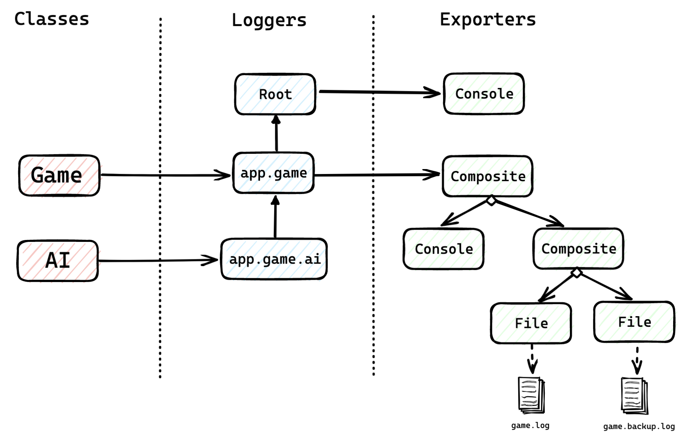

# 複合模式——日誌框架

## 背景知識：何謂日誌 (Logs)？

寫日誌 (Logging)
指的是在應用程式運行時，輸出訊息來描述每一個時間點的運行狀況，以便開發者偵錯。這些輸出的訊息就被稱之為是「日誌 (Logs)
」。而隨著應用程式的規模增大，日誌需要妥善的配置，如使用分級機制來管理日誌，以便開發者能在上千上萬行的日誌中快速找到重要的資訊。

但是要如何允許開發者輕易地配置日誌？於是各個程式語言都會發展出對應的日誌框架。

## A. 需求

你要開發一個日誌框架，開發者在日誌框架中定義多個日誌器 (Logger)，並且能在程式中取得和使用特定日誌器來撰寫日誌訊息 (
Message)。

1. **使用日誌器**：開發者能向日誌器請求撰寫不同分級 (Level) 的日誌訊息，訊息為不限長度的字串。
    1. **分級**：日誌器提供以下五個訊息分級，越上方分級越小。
        1. 追蹤等級（TRACE）
        2. 資訊等級（INFO）
        3. 偵錯等級（DEBUG）
        4. 警告等級（WARN）
        5. 錯誤等級（ERROR）
2. **日誌器配置**：開發者能在程式中定義多個日誌器，每個日誌器可以配置多項不同參數：
    1. **父日誌器 (Parent Logger)**：
       根日誌器 (Root Logger)以外的日誌器都要指定一個父日誌器。日誌器會繼承所有父日誌器在 _分級門檻_、
       _輸出器_ 和 _訊息佈置_ 上的設定。根日誌器必須要設定清楚 _分級門檻_ 、 _輸出器_ 和 _訊息佈置_
       ，而子日誌器只有在要覆寫父日誌器的設定時才需要設定
       _分級門檻、輸出器和訊息佈置_ ，沒有覆寫的參數則繼承父日誌器的設定。
    2. **分級名稱 (Logger’s name)** ：每個日誌器都要擁有一個唯一的名稱。開發者能用名稱來取得特定的日誌器。根日誌器的名稱必為
       `Root`。
    3. **分級門檻 (Level Threshold)** ：在開發者向日誌器請求撰寫某分級的日誌時，日誌器會根據自身的分級門檻評估要不要受理這項請求。
       **評估標準** ：開發者請求撰寫的分級必須大於或等於日誌器的分級門檻。
        - 舉例來說：如果日誌器的分級門檻為 _DEBUG_，則日誌器不會受理小於 _DEBUG_ 的分級訊息，如 _INFO_ 和 _TRACE_
          ，但會受理大於或等於 _DEBUG_ 的分級訊息，如 _DEBUG_ 、_WARN_ 和 _ERROR_。
    4. **輸出器 (Exporter)**：一旦開發者請求撰寫的日誌訊息通過分級門檻，日誌器緊接著要請求其指定的輸出器來輸出此日誌訊息。輸出器僅有以下幾種：
        1. **控制台輸出器 (Console Exporter)**：控制台輸出器會將訊息輸出至控制台 (i.e., 標準輸出）。
        2. **檔案輸出器（File Exporter）:** 檔案輸出器會將訊息添加 (Append) 至某個檔案中。
            - 開發者需要指定此輸出器的目標檔案名稱
        3. **複合輸出器 （Composite Exporter）**：如果想要一次指定多個輸出器的話，可以使用複合輸出器。複合輸出器中依序指定多個輸出器來輸出訊息。
    5. **訊息佈置 (Layout)**：決定輸出訊息的排版方式，目前僅支援以下一種排版：
        1. **標準日誌排版 (Standard Layout)：**`時間 |-訊息分級 日誌器名稱 - 訊息內容`
            1. 時間格式為： `yyyy-MM-dd HH:mm:ss.SSS`
            2. **訊息分級**： 開發者在請求撰寫訊息時選擇的分級，參照「需求規格」第一項中規範的五種訊息分級，並以大寫英文輸出。
            3. **日制器名稱**： 參照「日誌器配置」第二項說明，此為日誌器所擁有的唯一名稱。
            4. **訊息內容**： 開發者請求撰寫的訊息內容。
3. **使用日誌器**：開發者能在**程式任意處**取得某一名稱的日誌器。

## B. 設計需求

1. 參照「日誌配置」第四點對於輸出器的需求，在擴充需求中的輸出器種類時，應無需修改既有程式碼，遵守「開放封閉原則 (Open Closed
   Principle)」。
2. 參照「日誌配置」第五點對於訊息佈置的需求，在擴充訊息佈置的種類時，應無需修改既有程式碼，遵守「開放封閉原則」。

## C. 應用範例

本節使用虛擬碼描述開發者在程式中使用日誌框架的實際案例。假設開發者正在開發兩個類別 _Game_ 和 _AI_，程式入口為 _Main_。

開發者首先會在程式入口處定義和配置好根日誌器、_app.game_ 日誌器和 _app.game.ai_ 日誌器，然後在 Game 和 AI 類別中分別使用
_app.game_ 日誌器和 _app.game.ai 日誌器_ 來撰寫日誌訊息。

完整的配置如下圖所示：



### `Main.class`

```plaintext
main entry() {
    // 定義根日誌器
    var root = new Logger(LevelThreshold = DEBUG,
        exporter = new ConsoleExporter(),
        layout = new StandardLayout());

    // 定義 app.game 日誌器，繼承根日誌器並覆寫分級門檻和輸出器
    var gameLogger = new Logger(levelThreshold = INFO,
        parent = root,
        name = "app.game",
        exporter = new CompositeExporter(
            new ConsoleExporter(),
            new CompositeExporter(
                new FileExporter("game.log"),
                new FileExporter("game.backup.log")
            ),
        ));

    // 定義 app.game.ai 日誌器，繼承 app.game 日誌器並覆寫分級門檻
    var aiLogger = new Logger(LevelThreshold = TRACE,
        parent = gameLogger,
        name = "app.game.ai",
        layout = new StandardLayout());
    
    // 配置剛定義好的三個日誌器
    declareLoggers(root, gameLogger, aiLogger);

    // 創建遊戲物件，並執行遊戲
    Game game = new Game();
    game.start();
}
```

### 在 `Game.class` 中使用 `app.game` 日誌器來撰寫日誌

```plaintext
class Game {
    // 取得 "app.game" 日誌器，名為 log 屬性
    var log = getLogger("app.game");

    // 四個 AI 玩家，依序命名為 AI 1~4。
    var players = {new AI("AI 1"), new AI("AI 2"), new AI("AI 3"), new AI("AI 4")};

    // 模擬遊戲執行，請日誌器撰寫日誌訊息，並且做適當的訊息分級。
    start() {
        log.info("The game begins.");

        // 每個 AI 玩家輪流做決策
        for (var ai: players) {
            log.trace("The player *{ai.getName()}* begins his turn.");
            ai.makeDecision();
            log.trace("The player *{ai.getName()}* finishes his turn.");
        }

        log.debug("Game ends.");
    }
}
```

### 在 `AI.class` 中使用 `app.game.ai` 日誌器來撰寫日誌

```plaintext
class AI {
    // 取得 "app.game.ai" 日誌器，名為 log 屬性
    var log = getLogger("app.game.ai");
    var name;

    // constructor
    AI(name) {
        this.name = name;
    }

    // 模擬 AI 決策，請日誌器撰寫日誌訊息，並做適當的訊息分級。
    makeDecision() {
        log.trace("{name} starts making decisions...");

        log.warn("{name} decides to give up.");
        log.error("Something goes wrong when AI gives up.");

        log.trace("{name} completes its decision.");
    }

    getName() {
        return name;
    }
}
```

### 程式執行日誌結果

+ 程式執行日誌結果如下：

```plaintext
2022-09-26 11:59:27.918 |-INFO app.game - The game begins.
2022-09-26 11:59:27.962 |-TRACE app.game.ai - AI 1 starts making decisions...
2022-09-26 11:59:27.962 |-WARN app.game.ai - AI 1 decides to give up.
2022-09-26 11:59:27.962 |-ERROR app.game.ai - Something goes wrong when AI gives up.
2022-09-26 11:59:27.962 |-TRACE app.game.ai - AI 1 completes its decision.
2022-09-26 11:59:27.963 |-TRACE app.game.ai - AI 2 starts making decisions...
2022-09-26 11:59:27.963 |-WARN app.game.ai - AI 2 decides to give up.
2022-09-26 11:59:27.963 |-ERROR app.game.ai - Something goes wrong when AI gives up.
2022-09-26 11:59:27.963 |-TRACE app.game.ai - AI 2 completes its decision.
2022-09-26 11:59:27.964 |-TRACE app.game.ai - AI 3 starts making decisions...
2022-09-26 11:59:27.964 |-WARN app.game.ai - AI 3 decides to give up.
2022-09-26 11:59:27.964 |-ERROR app.game.ai - Something goes wrong when AI gives up.
2022-09-26 11:59:27.964 |-TRACE app.game.ai - AI 3 completes its decision.
2022-09-26 11:59:27.965 |-TRACE app.game.ai - AI 4 starts making decisions...
2022-09-26 11:59:27.977 |-WARN app.game.ai - AI 4 decides to give up.
2022-09-26 11:59:27.977 |-ERROR app.game.ai - Something goes wrong when AI gives up.
2022-09-26 11:59:27.977 |-TRACE app.game.ai - AI 4 completes its decision.
2022-09-26 11:59:27.978 |-DEBUG app.game - Game ends.
```

## D. 進階挑戰題

在維持「A. 需求」中所有需求的前提下，允許開發者撰寫一份 JSON 格式的檔案來定義和配置所有日誌器。

以上述程式範例為例，其 JSON 配置檔如下：

```json
{
    "loggers": {
        "levelThreshold": "DEBUG",
        "exporter": {
            "type": "console"
        },
        "layout": "standard",
        "app.game": {
            "levelThreshold": "INFO",
            "exporter": {
                "type": "composite",
                "children": [
                    {
                        "type": "console"
                    },
                    {
                        "type": "composite",
                        "children": [
                            {
                                "type": "file",
                                "fileName": "game.log"
                            },
                            {
                                "type": "file",
                                "fileName": "game.backup.log"
                            }
                        ]
                    }
                ]
            },
            "app.game.ai": {
                "levelThreshold": "TRACE"
            }
        }
    }
}
```
