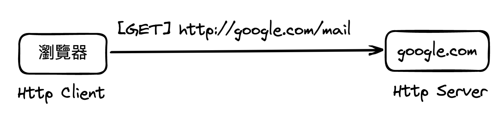
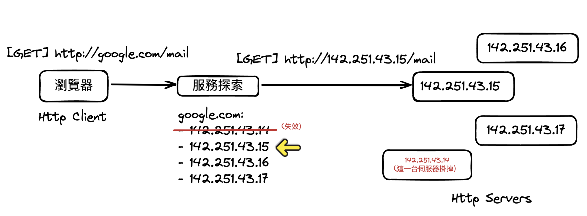

# 裝飾者模式——服務探索/負載平衡 (Service Discovery/ Load Balancing) 機制

你要實作一個服務探索機制！在微服務 (Microservices) 時代興起之後，各式各樣的微服務設計模式也被提出，而服務探索機制 (Service
Discovery) 就是其中的一部分。

如果你沒有後端設計的經驗或者是不了解微服務的話，不用擔心，這道題目不要求你有深厚的後端應用背景，需求會將所需知識講述清楚，所以你能夠直接下去
OOADP！

## 基本需求

閱讀以下需求時，若有遇到不清楚的地方，可能代表你需要參考背景知識章節中的知識。不過不用擔心，我已將所有所需的背景知識皆放在此需求文件當中啦！其實我已將題目調整成無須太多背景知識涉略的範疇，不過這些背景知識都是實際的後端知識，我還是忍不住分享較多的知識，請各位冒險者就當作是一場精心設計的科普吧！畢竟軟體設計學就是拿來實務應用的嘛，所以除了在旅程中學軟體設計技法/心法之外，肯定還要多多挖寶學習各領域的應用囉。

而裝飾者模式在後端應用上我看過最華麗的部分，就所屬這一題的服務探索/負載平衡機制啦！

### A. 功能性需求

1. 你要實作一個支援各種機制搭配的 **Http Client** 套件，這個 Http Client 套件能允許使用者藉由 Http/Https 協定取得某一 URL
   網址下的內容（此題目只要求支援「取得 (Http GET)
   操作」，POST、PUT 等其他操作皆無須支援）。
2. 支援 服務探索 (Service Discovery) 機制：套件的 Client 能配置某一個對照表配置文件來指定某一 Host 對應的 Server IP 序列。
    1. 服務探索機制在接收包含某一 Host 的網址請求時，會將 Host 替換成 IP 序列中第一項仍然有效的 IP，並將 IP 替換至網址內的
       Host 之後發出 HTTP 請求。若此請求成功，則一切不變；若此請求失敗了，則將此 IP 從序列中暫時失效 (10 分鐘），10 分鐘之後這一項
       IP 在序列中會回覆其有效狀態。

    2. **例子：**

        - 情境：Client 配置了以下檔案，並且其中 35.0.0.1 這項 IP 的伺服器處於下線狀態。

            ```txt
            waterballsa.tw: 35.0.0.1, 35.0.0.2, 35.0.0.3
            ```

        1. Client 發出請求 `http://waterballsa.tw/world` ，服務探索機制會將請求網址替換成 `http://35.0.0.1/world`
           ，請求後會發現請求失敗，服務探索機制此時將 35.0.0.1 列為失效 IP。
        2. Client 再次發出請求 `http://waterballsa.tw/world` ，服務探索機制會將請求網址替換成 `http://35.0.0.2/world`
           ，請求後會發現請求成功。
        3. 10 分鐘之後，Client 再次發出請求 `http://waterballsa.tw/world` ，服務探索機制會將請求網址替換成
           `http://35.0.0.1/world` ，請求後會發現請求失敗，服務探索機制又會將 35.0.0.1 列為失效 IP。

3. 支援 負載平衡 (Load Balancing) 機制：套件的 Client 能夠開啟負載平衡機制，負載平衡的策略為「輪流（也被稱之為 Round
   Robin）」，他會將請求依序輪流傳送到該
   Host
   對應的一序列 IP 地址。

    1. **例子：**

        1. **情境**：Client 有開啟服務探索機制，並且配置了以下檔案。

            ```txt
            waterballsa.tw: 35.0.0.1, 35.0.0.2, 35.0.0.3
            ```

            1. 第一次 Client 發出請求 `http://waterballsa.tw/world` 後，負載平衡機制會將網址轉成 `http://35.0.0.1/world`
               ，第二次發送同網址的請求則會被轉成 `http://35.0.0.2/world` 、第三次則為`http://35.0.0.3/world` 、第四次則為
               `http://35.0.0.1/world` 重新新的一輪，以此類推。
            2. 如同服務探索機制，失效的 IP 位址並不會被選擇為伺服器 IP，直到該 IP 恢復生效為止。

4. 支援黑名單機制：這個機制的概念相對簡單許多。套件的 Client 首先要提供一個黑名單表，表中記載著一系列的黑名單 Host（以逗號隔開）。
   如果套件的 Client 開啟黑名單機制，則當 Client 之後請求的網址中包含黑名單 Host 時，套件會中止此請求並拋出例外。

### B. 程式設計需求

1. 程式碼中不能有超過 3 行的重複程式行為 (Code Duplication)。
2. 允許 Client 能夠自由地決定要支援哪些機制：需求中目前列出三種機制，Client
   能夠選擇這三種機制的任意排列組合，如：「服務探索 → 負載平衡 → 黑名單」這個排列組合下的機制、或者是改變一下順序「黑名單 →
   負載平衡 → 服務探索」，或者是拿掉其中一項：「服務探索 → 負載平衡」、「負載平衡 → 黑名單」，甚至完全不啟動任何機制都行。
    1. 不管是哪一種排列組合，每一個機制都能依照同一套邏輯順利運行。
        - 最理想的使用上當然是照著 「服務探索 → 負載平衡 → 黑名單」這個順序來排列機制，所以當 HttpClient
          發起請求時，能有連貫的機制行為，如下：
            1. **套件的 Client 發起請求**：`http://waterballsa.tw/mail`
            2. **服務探索**：探索到 http://\[35.0.0.1, 35.0.0.2, 35.0.0.3, 35.0.0.4\]/mail 四種有效網址
            3. **負載平衡**：呈上一步中給出的四個選項，從中輪流並選擇 http://35.0.0.1/mail
            4. **黑名單**：確定 35.0.0.1 不在黑名單之中，如果是黑名單則中斷且拋出錯誤。
            5. **實際的 Http Client**：送出請求 http://35.0.0.1/mail。
        - 如果是「黑名單 → 負載平衡 → 服務探索」這個看似不合理的排列也必須能運作，只是運作結果可能有所不同：
            1. 套件的 Client 發起請求：http://waterballsa.tw/mail
            2. 黑名單：確定 waterballsa.tw 不在黑名單之中，如果是黑名單則中斷且拋出錯誤。
            3. 負載平衡：由於只有一個選項 \[http://waterballsa.tw/mail\]，所以選擇 http://waterballsa.tw/mail
            4. 服務探索：探索到 http://\[35.0.0.1, 35.0.0.2, 35.0.0.3, 35.0.0.4\]/mail
               四種有效網址，並預設選擇第一項 http://35.0.0.1/mail
            5. 實際的 Http Client：送出請求 http://35.0.0.1/mail。
3. Client 能夠在不修改既有套件程式碼的前提之下，擴充自己的 Http Client 機制。也能夠在不修改既有套件程式碼的前提之下，實作除
   `FakeHttpClient` 之外的 `HttpClient` 實作。

### C. 你無需實作 Http 協定，只需要實作模擬用的 `FakeHttpClient`

1. 你無須自己實作 Http Client 所需的協定，此需求只要你開出一個「假的 Http Client (Fake Http Client)」的類別作為模擬/偵錯用就行了。
    - 你可以開一個 `FakeHttpClient` 類別，他有一個 `sendRequest(request: HttpRequest)` 操作，而這操作中並不會真的把 Http
      請求發送出去，而是直接用 Standard output 把請求動作的相關訊息輸出至 Console 上即可。
    - 你可以隨意決定`FakeHttpClient` 的 `sendRequest` 行為是否能成功地將 Http
      請求送出（模擬）。像是隨機決定這一次請求是否成功，以 [http://test.tw/waterball](http://google.com/mail) 請求為例，成功的話就印出
      `[SUCCESS] http://test.tw/waterball` ，失敗的話就直接**噴例外**。

## 背景知識

### 什麼是 Http Client？

要理解 Http Client 的話，就要先理解何謂 HTTP 請求。

首先，「Http 是一種網路應用層協定」。若你不熟悉網路相關知識的話不要擔心，你只需要在我的引導下對他做多一點的想像和理解。

想像一下，當你在瀏覽器輸入網址 [http://google.com/mail](http://google.com/mail) 時，瀏覽器做了哪些事以致於你最後能在瀏覽器上瀏覽
Google 搜尋引擎的頁面？

瀏覽器做的事情細項非常多，但若是為了完成這份挑戰題的話，你只需要理解以下這個有趣互動：

當使用者在瀏覽器輸入網址 [http://google.com/mail](http://google.com/mail) 之後⋯⋯

**瀏覽器：**「欸！偉大的網路技術，請你幫我透過 **http**
這一個管道（協定），取得[http://google.com/mail](http://google.com/mail) 下的資料啊！」瀏覽器向偉大的網路技術拋出了他的請求。

接著網路技術就會順應這個請求，透過 http 管道 (協定），登門 [http://google.com/mail](http://google.com/mail)
拜訪來取得其下的資料，然後將這個資料回傳給瀏覽器。

瀏覽器收到資料之後，由於這個資料的內容是一個 Google
的搜尋頁面網頁，於是瀏覽器接著就會說：「喔～謝啦！嗯，這資料的內容看起來是一個網頁 (HTML)，那我就把它畫出來吧！」

所以使用者才會在瀏覽器上看到視覺化之後的網頁。

我們可以將瀏覽器的這一項請求使用 Http Request 的方式正式標示為以下網址：`http://google.com/mail` ，這一串網址又被稱之為「Uniform
Resource Locator (URL)」，其意義為無論是誰都能透過這個網址來取得某一項資源/資料。

而在這個挑戰題中，你只需要理解 URL 中的**三個主要組成部分：`<scheme>://<host><path>`**

1. **scheme**：為這次請求用到的協定。
2. **host**：可能是如 [google.com](http://google.com/) 這樣子的「網域 (domain name)」，也可能是實際的 IP
   位置（如：140.112.31.58)。
3. **path**：在該 host 下請求的目的地。以本例來看的話，我們正是請求 [google.com](http://google.com/) 這個 host 底下的
   `/mail` 目的地，可以理解成請求存取 google.com 提供的電子郵件服務。

而除了 URL 之外，HTTP 請求通常還會額外標示說，他想要對這一項 URL 網址下的資源/資料，做何等「操作 (Http Method)」。以上述瀏覽器存取
http://[google.com/mail](http://google.com/mail) 為例的話，就是一般的取得 (Http GET) 操作。除了 GET 以外，還有
POST、PUT、DELETE⋯⋯等等，不過由於挑戰題只要你處理 GET 操作即可，所以你無需深入理解不同操作之間的差異。

大致了解完什麼是 Http 請求之後，接下來就能簡單區分出 Http Client 和 Http Server。以本案例來看的話，發出 Http 請求的瀏覽器就是
Http Client，而接收請求並處理請求的 [google.com](http://google.com/) 就是 Http server 唷！



要注意，本挑戰題並不是希望你實作 Http Client 本身（這會要求你了解 Http 協定，並不是這一題挑戰題的本意），而是希望你能夠設計出一個套件，這個套件能夠方便我們客製化
Http Client 在「發送 Http 請求之前可能希望執行的『**行為組合**』」。

舉例來說：在瀏覽器發送每一道 Http 請求之前，你會不會希望瀏覽器幫你檢查請求目的地是不是釣魚網站？或是幫你查看請求目的地是不是正在繁忙當中，是否有其他替代的目的地？等等...存在著各式各樣的行為組合。

而在當前「微服務架構」興起的時代下，由於系統中的每一個角色都能同時扮演 Client 和 Server 來和彼此溝通，Http Client
套件的方便程度大幅影響著開發者的開發效率。因此人們發展出了因應微服務架構的各種 Http Client 套件行為搭配組合。

本挑戰題的 **服務探索/負載平衡 (Service Discovery/ Load Balancing)**，就是最常見的一種組合囉！

### 服務探索機制 (Service Discovery)

為了理解何謂**服務探索機制**，我們先來思考一個問題：「如果今天 [google.com](http://google.com/) 這個 Host 所對應的伺服器掛掉了怎麼辦？」

如果掛掉了，那當 Http Client 請求 [http://google.com/mail](http://google.com/mail) 網址時，請求就會失敗！

所以一般來說我們都會對伺服器做多份備份 (Replica)，意思就是準備多台伺服器啦～！

可是接下來就會有另一個衍生問題：「如果你準備多台 Http Server 的話，那麼 [google.com](http://google.com/) 這個 Host 究竟對應的
Server 是哪一台啊？？？？」

服務探索機制因此而生。服務探索機制正是幫助 Http Client 尋找每一項 Host
對應的**實際伺服器**的一項模式。不過此模式有許多各式各樣的實作方式，在此題中只要求你開發最簡單的一種實作。

最簡單的實作方式，就是服務探索機制套件允許我們向他配置以下這種配置檔案：

    ```txt
    google.com: 142.251.43.14, 142.251.43.15, 142.251.43.16, 142.251.43.17
    waterballsa.tw: 35.21.35.18, 35.21.35.19, 35.21.35.20
    ...
    ```

在以上這個配置檔案中，我們配置了兩項 Host 的服務探索配置，他代表的意義如下：

- 服務於 `google.com` 這項 Host 的伺服器 IP 有以下這四項：
    - `142.251.43.14`
    - `142.251.43.15`
    - `142.251.43.16`
    - `142.251.43.17`
- 服務於 waterballsa.tw 這項 Host 的伺服器 IP 有以下這三項：
    - `35.21.35.18`
    - `35.21.35.19`
    - `35.21.35.20`

做完配置之後，服務探索機制就有了「Host → 對應伺服器 IP 序列」的對照表資訊。當 Http Client 請求位於某一項 Host 的網址 (
如：http://google.com/mail)時，服務探索會從對照表中取得該 Host 對應的伺服器 IP 序列（如：
`google.com → [142.251.43.14, 142.251.43.15, …]`），並依序從其中的第一項 IP
開始嘗試請求（如：送出 http://142.251.43.14/mail 請求）。如果該 IP 請求失敗的話，就會暫時將該 IP 從序列中刪除，並反映錯誤。

當 Http Client 下一次請求位於同一個 Host 的網址時，由於第一項 IP 已經被刪除了，服務探索機制就會從該 Host 原先的第二項 IP
開始嘗試請求起（如：送出 http://142.251.43.**15**/mail 請求）。

如下圖所示。如此一來 Http Client 就能夠仰賴服務探索機制，來決定要訪問的究竟是哪一個 Http Server IP，並且會幫忙排除失效的
Server IP。



> **如果只是對照表這種運作方式而已的話，那為什麼要將這個機制命名成「服務探索」這麼高大上的名字？** 答：當然不只是這樣而已啦～真正實務上並不會讓
> Client 提供對照表配置，而是透過某種協定讓 Http Client 能真的「探索」，並且「發現」所有有效的 Server IP
> 而自動生成對照表唷。相關的機制就先打住為止，各位可以上網查 Client-Side / Server-Side Service Discovery。

### 負載平衡 (Load Balancing)

在服務探索機制之上，我們通常還會搭配另一個非常常見的機制，就是負載平衡 (Load Balancing) 機制。

負載平衡如其名所說，目的是希望：「所有伺服器接收的工作量負載平衡。」，這樣子才能發揮每一台伺服器最好的工作效率。

在服務探索機制中我們已經配置好了「Host 與其對應伺服器 IP 序列」的對照表，那負載平衡機制可以很簡單地在這個對照表的想法上加以改進。

所以到底該如何讓所有伺服器接收的工作量負載平衡呢？答案當然就如你直覺所想得那樣，那就是「輪流」啊！

我們延續上圖案例來示範，一個負載平衡機制會幫助 Http Client 類似於以下所示的行為：

在第一次 Http Client 呼叫 `http://google.com/mail`
時，負載平衡會參考對照表，並將實際送出的網址請求改成 `http://142.251.43.14/mail` 。

那第二次 Http Client 再次呼叫 `http://google.com/mail` 的話呢？

是的，負載平衡第二次送出的網址請求為 `http://142.251.43.15/mail` ，然後接著為 `http://142.251.43.16/mail`,
`http://142.251.43.17/mail`, 再回到 `http://142.251.43.15/mail`, 接著 `http://142.251.43.16/mail` ...以此類推。

「輪流」的概念就是如此唷！這樣子你明白了嗎？
