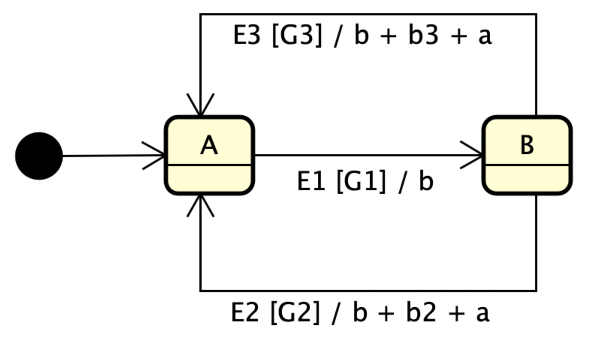
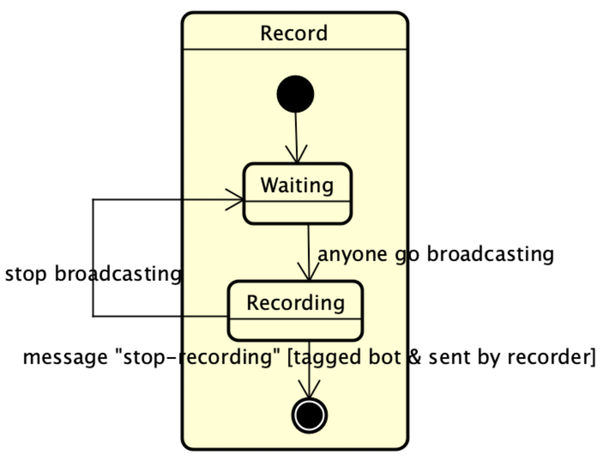
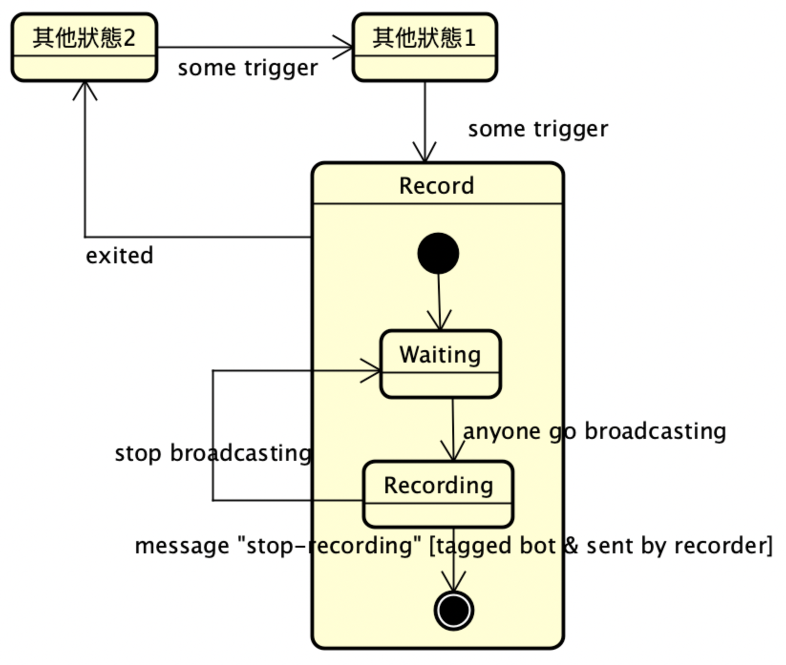
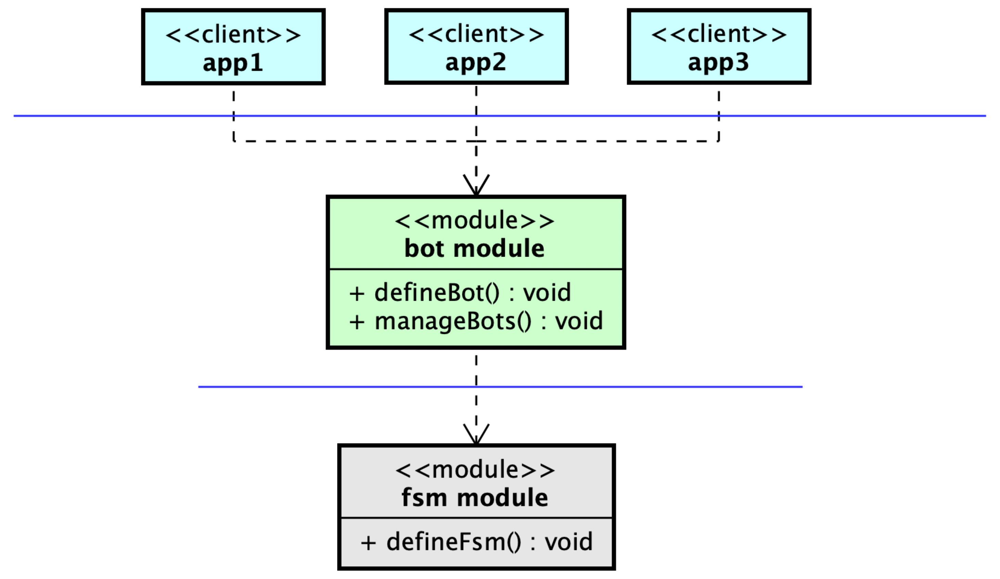

# 魔王題：社群機器人引擎 | 有限狀態機框架 ★★★★

## 魔王對冒險者們的喊話

各位冒險者們好，我是副本四的魔王。

相信各位在副本三時，已經體驗過魔王題的複雜度。這個複雜度可能會使「新手」受挫，但你已經不再是新手了，能走到這裡就說明：「你開始懂得如何在旅程高頻率回饋的學習環境下，期待每一次受挫之後隨之而來的大幅度認知成長」。

而對老手而言，你應該早已發現自己思路上的變化，開始看見軟體實作中，不只存在邏輯，還存在著各種無形的約束勁力 (Forces)，這些勁力來自於兩個源頭，一是需求中涉及的業務邏輯，二是身為工程師，我們對軟體維護性上的要求。

只要能夠看清楚這兩種勁力，就能分析出該將軟體打造成何等特定的形狀 (Form)，來化解這些勁 (Resolving forces)。

這是一套武功，武功中的每一個環節都是快速、細緻且連貫，使你行雲流水。從需求中快速做好物件導向分析 (OOA)，來對概念、結構有八成的掌握，接著再關注模型之上是否有形成 Conflicting Forces。隨著你熟悉更多的 Forces，你看待設計問題 (Problem) 的方式就會改變、變得更加細膩。你不再需要使用過度簡化的句子來描述 Problem，而是列出造成 Problem 困難的衝突 Forces。而只要知道特定的一組 Forces，你就能加以分析來得到對應的模式 (Pattern)。

這一套武功我們不斷反覆內化，所以漸漸地，一星和二星題對你來說已不再構成威脅，就連三星題對你來說也僅是有挑戰性的專案。

現在呀，冒險者，你終於來到了副本四的魔王題。

副本四的魔王題會要求不同面向上的深度能力。雖說設計模式能在設計上提供良好的指導，幫助我們理解分析和逐個擊破問題，不過有一項能力是必須上高強度鍛鍊後才能練就的，那就是「萃取能力」。

什麼叫「萃取能力」，其實各位多少都明白了，那就是能從一群事務中「留同存異」，並能設計一套能「適用於各種情境」—— 制定框架的能力。副本四魔王題會開始要求你在「萃取」能力上更深一步的造詣，請各位冒險者在撰寫的過程中，依然保持良好的 OOAD 習慣，別輕敵、也別輕視需求，一步一腳印地做好武功中的每一個動作。

所有的難題都將在你最意想不到的時候發生，加油！冒險者！

## A. 初版實作需求：簡易社群機器人

由於最近你正在經營 Waterball 社群，而隨著 Waterball 社群的成員越來越多，你希望能夠研發出一款「社群機器人」，讓這社群機器人能自主和成員們互動，或是允許成員們能下達指令給機器人。

### 1. Waterball 社群

首先介紹一下 Waterball 社群的功能，你現在正在經營著一個「Waterball 社群」，社群中有著以下基礎建設：

1.  社群中主要由「聊天室」、「論壇」和「廣播」頻道構成，且社群只會有**一個**聊天室、論壇和廣播頻道。：
    1.  **聊天室 (Chat Room)**：聊天室是社群成員們聊天的地方。成員可以在聊天室中發送訊息 (Message)，訊息中包含文字內容 (Content) 和零到多個標記 (Tag)。
        1.  每個標記涵蓋某一位成員的 ID （代表其身份）。標記的目的是通知對方該則訊息是在回應對方。
        2.  每位成員的 ID 為一字串（不超過 20 個字元），且唯一（不同成員必定擁有不同 ID）。
    2.  **論壇 (Forum)**：論壇是社群成員用來發布貼文 (Post) 的地方。
        1.  成員在論壇發布貼文 (Post)，貼文中包含標題 (Title)、內文 (Content)，以及標記 (Tag)（等同聊天室中訊息的標記）。
        2.  貼文發布之後，成員可以在該貼文底下留言 (Comment)。留言包含內文 (Content) 和標記 (Tag)（等同聊天室中訊息的標記）。
    3.  **廣播 (Broadcast)：** 成員們可以透過「開始廣播 (Go broadcasting)」，來打開麥克風與透過語音傳輸訊息。
        1.  同一時間只能有零到一位成員正在廣播。
        2.  只有「廣播」之後，才有權限傳遞語音訊息 (Speak)。
        3.  廣播之後，成員可以決定何時停止廣播 (Stop broadcasting)。
2.  社群成員要再登入 (Login) 之後，才能開始在聊天室、論壇和廣播等頻道活動，若成員決定離線，則會登出 (Logout)。
3.  社群成員有兩種權限：管理員 (Admin)，或是一般的成員 (Member)。

### 2. 社群機器人需求

1.  社群機器人的行為主要用「狀態」區分。主要的狀態有「正常 (Normal)、錄音（Record）、知識王（KnowledgeKing）」三種，機器人同一時間下只會處於某一種狀態中。
2.  社群機器人在每個狀態中，皆提供了一些指令供成員/管理員使用。成員可以在聊天室中透過「**傳遞標記機器人的訊息**」來下達指令，不過指令有使用額度 (Quota) 的上限，如果額度不足則機器人不予受理。
3.  每當 Waterball 社群中有事件發生時，機器人會根據自己當下的「狀態」來決定對應的「行為」，也有可能決定要改變狀態：
    1.  **正常狀態 (Normal)：**

        1.  正常狀態又存在兩個子狀態：**預設對話狀態（Default Conversation）** 和 **互動狀態（Interacting）**。
        2.  如果線上人數 < 10，則初始狀態為**預設對話**狀態，否則初始狀態為**互動**狀態。
        3.  **指令**：
            1.  `king` ：
                1.  **額度**：5
                2.  **權限**：只有**管理員**方可使用
                3.  **效果**：機器人會進入「知識王」狀態，開始主持一場知識王遊戲。
            2.  `record`：
                1.  額度： 3
                2.  **權限**： **任何成員**皆可使用（使用此指令的人被稱之為**錄音者** (recorder))
                3.  **效果**： 機器人會進入「錄音」狀態。
        4.  **預設對話狀態（Default Conversation）：**
            1.  當有成員在聊天室中傳遞訊息時，機器人會依序回覆該成員以下三則訊息之一（三則輪完之後就回到第一則訊息），訊息中會標記該成員：

                1.  `good to hear`

                2.  `thank you`

                3.  `How are you`

                4.  **範例** （`💬 <成員 ID>: <成員訊息> @<標記>`、`🤖: <機器人訊息> @<標記>`）

                        💬 1: 大家早安，今天我第一天上班呢 
                        🤖: good to hear @1
                        💬 4: 祝大家今天事事順利 @1
                        💬 4: 祝大家今天事事順利 @1
                        🤖: thank you @4
                        💬 5: 嗯嗯嗯！ 
                        🤖: How are you @5
                        💬 5: 還行啊 @bot
                        🤖: good to hear @5

            2.  當有成員在論壇中發布貼文時，機器人會在貼文底下留言：`Nice post`，並標記發文者。
                
                -   範例（`<成員 ID>: 【<成員貼文標題>】<貼文內容> @<標記>`、`🤖 comment in post <貼文 ID>: <留言內容> @<標記>`）。
                    
                        2: 【物件導向冷知識】和大家分享一個冷知識，其實是先有「物件」才有「類別」喔！大家學會了嗎？
                        🤖 comment in post 1: Nice post @2

            3.  當有成員**登入**時，機器人會評估目前在線人數是否 `≥ 10` ，如果 `≥ 10` 則機器人會進入「互動狀態」。

            > 請注意，在線人數的計算要包含機器人，也就是說如果除機器人以外有 9 位成員登入，則在第 9 位成員登入後，在線人數就已達 10 人。
        
        5.  **互動狀態（Interacting State)**：
            1.  當有成員在聊天室中傳遞訊息時，機器人會依序回覆該成員以下兩則訊息之一（兩則輪完之後就回到第一則訊息），訊息中會標記該成員：
                1.  `Hi hi😁`
                    
                2.  `I like your idea!`
                    
                3.  範例（`💬 <成員 ID>: <成員訊息> @<標記>`、`🤖: <機器人訊息> @<標記>`）
                    
                        💬 1: wow 有 10 個人在線上了呢（包含機器人） 
                        🤖: Hi hi😁 @1
                        💬 1: 大家早安，今天要吃麥當勞嗎？ 
                        🤖: I like your idea! @1
                        💬 1: 謝謝 @bot
                        🤖: Hi hi😁 @1

            2.  當有成員在論壇中發布貼文時，機器人會在貼文底下標記所有在線上的成員（包含機器人自己），並且留言：`How do you guys think about it?`
                -   範例（`<成員 ID>: 【<成員貼文標題>】<貼文內容> @<標記>`、`🤖 comment in post <貼文 ID>: <留言內容> @<標記>`），假設目前在線上的用戶有： `@bot, @1, @2, @3, @4, @5, @6, @7, @8, @9`。
                    
                        8: 【分享一個關於 單一職責原則 的笑話，每次講起來都還是覺得很好笑】(1) 欸你這個類別這樣做太多事了吧，違反單一職責原則啊，每個類別只能有一個職責，只能做一件事。 (2) 這個類別，確實只做一件事，那就是實現需求！
                        🤖 comment in post 2: How do you guys think about it? @bot, @1, @2, @3, @4, @5, @6, @7, @8, @9

            3.  當有成員**登出**時，機器人會評估目前在線人數是否 `< 10` ，如果 `< 10` 則機器人會回去「預設對話狀態」。
    2.  **錄音狀態 （Record State）**：
        
        1.  錄音狀態又存在兩個子狀態：**等待狀態（Waiting）** 和 **錄音中狀態（Recording）。**
            
        2.  如果已經有講者正在廣播，初始狀態為錄音中狀態，**否則會直接進入等待狀態**。
            
        3.  **等待狀態（Waiting）**：
            
            1.  當有成員開始廣播之後，就會進入「錄音中狀態」。
        4.  **錄音中狀態（Recording）**：
            
            1.  當有成員講者 (Speaker) 在傳輸語音訊息 (Speak) 時，會將每一筆語音訊息的文字記錄下來。
            2.  直到該講者結束廣播後，會將講者廣播過程中錄下的所有語音訊息，以「Record Replay（請見第五項）」格式輸出、標記講者且傳訊到聊天室中，最後回到等待狀態。
        5.  **指令**：
            
            1.  `stop-recording`
                1.  **額度**：0
                2.  **權限**：只有錄音者方可使用
                3.  **效果**：
                    1.  如果此時為錄音中狀態，會將講者廣播過程中錄下的所有語音訊息，以「Record Replay（請見第六項）」格式輸出、標記講者且傳訊到聊天室中。
                    2.  回到正常狀態（結束錄音）。
        6.  **Record Replay 格式：**
            
                [Record Replay] <每一筆語音訊息之間會以「換行符號」隔開>

        7.  範例（`💬 <成員 ID>: <成員訊息> @<標記>`、`🤖: <機器人訊息> @<標記>`、`📢 <講者 ID>: <廣播語音訊息>`）
            
                💬 3: record @bot
                🤖: thank you @3
                📢 4 is broadcasting...
                📢 4: 大家好，我是小華！
                📢 4: 歡迎來到小華脫口秀
                📢 4: 請問大家⋯⋯軟體工程師最常說的謊言有哪些？
                📢 4: 是 TODO 註解！！
                📢 4: 身為IT從業人員，你覺得有什麼工具大大提高了工作效率？
                📢 4: 單身
                📢 4: 感謝大家的支持，這就是今晚的小華脫口秀啦！
                📢 4 stop broadcasting
                🤖: [Record Replay] 大家好，我是小華！
                歡迎來到小華脫口秀
                請問大家⋯⋯軟體工程師最常說的謊言有哪些？
                是 TODO 註解！！
                身為IT從業人員，你覺得有什麼工具大大提高了工作效率？
                單身
                感謝大家的支持，這就是今晚的小華脫口秀啦！ @3
                📢 3 is broadcasting...
                📢 3: 我再來補一個笑話！
                📢 3: 這個世界上有 10 種人啊
                📢 3: 懂二進制的人⋯⋯
                📢 3: 和不懂二進制的人！！
                💬 3: stop-recording @bot
                🤖: [Record Replay] 我再來補一個笑話！
                這個世界上有 10 種人啊
                懂二進制的人⋯⋯
                和不懂二進制的人！！ @3

    3.  **知識王狀態 (Knowledge King)**：
        
        1.  知識王狀態又存在兩個子狀態：**出題狀態（Questioning）** 和**感謝參與狀態（ThanksForJoining）**，初始狀態為出題狀態。
        2.  **指令**：
            1.  `king-stop`
                1.  額度：0
                2.  **權限**：只有**管理員**方可使用
                3.  **效果**：機器人會進入「正常」狀態。
        3.  **出題狀態（Questioning）**：
            1.  知識王為「考題競賽」遊戲，總共有 3 題題目：
                1.  **第 1 題：**
                    
                        請問哪個 SQL 語句用於選擇所有的行？
                        A) SELECT *
                        B) SELECT ALL
                        C) SELECT ROWS
                        D) SELECT DATA
                         
                    -   **答案**：A
                2.  **第 2 題：**
                    
                        請問哪個 CSS 屬性可用於設置文字的顏色？
                        A) text-align
                        B) font-size
                        C) color
                        D) padding

                    -   **答案**：C
                3.  **第 3 題：**
                    
                        請問在計算機科學中，「XML」代表什麼？
                        A) Extensible Markup Language
                        B) Extensible Modeling Language
                        C) Extended Markup Language
                        D) Extended Modeling Language

                    -   **答案**：A
            2.  每一題中的第一位正確答題者會獲得 1 分。
            3.  只要一有人正確答題，機器人首先會在聊天室傳遞訊息（標記獲勝者）`Congrats! you got the answer!`，並接著出下一題。如果每一題都答完了，就進入**感謝參與狀態。**
            4.  若在 1 小時之後，這 3 題尚未全部答完，那麼也會立即中斷且進入**感謝參與狀態**。
        4.  **感謝參與狀態（ThanksForJoining）**：
            1.  一進入感謝參與狀態時，分成兩種情況：如果此時沒有成員正在廣播，則機器人會進行廣播，並透過語音訊息公布遊戲結果，否則就會聊天訊息來公布遊戲結果。
                1.  格式：
                    1.  如果無人獲勝：`Tie!`
                    2.  如果有人獲勝：`The winner is <獲勝者 Id>`
            2.  20 秒之後，知識王狀態就會結束，機器人回到正常狀態。
            3.  **指令：**
                1.  `play again` ：
                    1.  額度：5
                    2.  **權限**：任何成員皆可使用
                    3.  **效果**：
                        1.  機器人在聊天室傳遞訊息：`KnowledgeKing is gonna start again!`
                        2.  機器人會進入「出題」狀態（再玩一次知識王）。

## 設計需求 - 1：FSM 模組設計 — 讓開發者能更有表達力地描述「機器人」的運作邏輯

如果你仔細實作出以上需求中提到的社群機器人，那在實作過程中也許你會覺得「有一點煩悶」。在實作過程中似乎就是不斷地寫著「當機器人在某個狀態下，發生什麼事情後，如果符合何等條件，則會做哪些事」的邏輯。這樣的邏輯不斷重複，使程式碼單純充斥著各式各樣的曹狀 If-else 條件式。

**所以⋯⋯「邏輯」到底是哪裡重複了？**

重複的部分，就剛剛好是**狀態機**中——「狀態 (State)」和「轉移 (Transition)」這兩者元素交互的邏輯。

### 1. 複習狀態機圖 (State Machine Diagram)

我們在副本三中的「狀態模式」時，學到了我們能藉由繪製「狀態機圖 (State Machine Diagram)」來分析複雜的類別行為。透過繪製狀態機圖，我們能夠大致拆解出類別的複雜行為，或者說：「我們能夠用『狀態機圖』來去定義一個類別的複雜行為/職責。」

狀態機之所以被稱之為狀態機，就因為他像是機器般，能遵守狀態之間的轉移規則不斷運作下去。機器人也是如此，給定了一定的規則之後，機器人便永遠遵照這些定義好的規則，像機器般不斷運作下去。

**那麼，如果「狀態機」中存在「有限」個狀態的話，我們就能稱他為一款「有限狀態機 (Finite-state Machine, FSM)」。**

白話文來說，是因為以下這兩道邏輯不斷出現，使你在實作社群機器人時重複撰寫著 If-else 條件式：

1.  若機器人在某種狀態 (State) 下時，發生某個事件 (Event)，此時若某種條件 (Guard) 達成，機器人會觸發 (Trigger) 轉移 (Transition) 到另外一個狀態。(When an event occurs in a given state and meets the guard's criteria, it will trigger the transition to another state.)
2.  當機器人進入此狀態時，會先做「進場行為 (Entry Action)」；而當機器人離開此狀態時，則會做「出場行為 (Exit Action)」。

### 2. 設計要點：有表達力地描述社群機器人的複雜行為

總結來說：只要你能開發出一款「有限狀態機模組」，接著就能用這台有限狀態機模組，來清楚表達任何大多數社群機器人的行為邏輯。

好比以下這段虛擬程式碼所述：

    var A = new State(enter=a)
    var B = new State(enter=b, exit=b)
    
    var fsm = new FiniteStateMachine(initial=A, 
         transitions = [
         new Transition(from=A, event=E1, guard=G1, to=B),
         new Transition(from=B, event=E2, guard=G2, action=b2, to=A)
         new Transition(from=B, event=E3, guard=G1, action=b3, to=A)
         ]
    )

1.  這段虛擬程式碼，能夠建立出以下這張狀態機圖所表示的行為：

2.  狀態機能簡潔表達的狀態轉移行為，拿最下方的 `E2 [G2] / b + b2 + a` 這條轉移式作為例子，當 FSM 在 B 狀態時發生了 E2 事件，且符合 G2 條件，會依序執行 b, b2 和 a 這三道行為 (`b+b2+a`)。而這三道行為分別是來自於：
    1.  B 狀態的 **exit action** (也就是 b，宣告於第二行程式碼)
    2.  這條轉移本身的 **action** (也就是 b2，宣告於第七行程式碼）
    3.  A 狀態的 **entry action** (也就是 a，宣告於第一行程式碼）
3.  並且，開發者會在 `A` 和 `B` 類別中專注描述該狀態下的各種事件響應行為。好比可能是在 `A` 狀態類別中撰寫程式描述，當聊天室有新訊息時，處於 `A` 狀態的機器人會如何回應該訊息⋯⋯等等。
4.  如果你能夠巧妙設計好 FSM 模組中的， `FiniteStateMachine` 和相關介面，如 `Transition` 、`Guard` 、`Trigger`、`Action`、`State`⋯⋯等等介面，並提供一組預設的有限狀態機實作，讓 Client 可以自由組裝自己想要的有限狀態機邏輯，那麼當我們在實作社群機器人時，同樣也就能善用 FSM 模組中的這些功能來高表達力地實現各式各樣的機器人邏輯。

### 3. 總結設計需求

1.  你需要實作一個「有限狀態機模組 (FSM module)」，來最大化社群機器人行為撰寫的表達力，藉此同時增加開發者的生產力。

    > 模組其實就是套件的意思，你可以簡單將模組理解成只是「一堆類別和介面的集合」。

    > 不過有限狀態機應該要是一個獨立的模組，FSM 模組並不知曉「社群機器人」這個概念，此模組唯一的職責範圍就是允許開發者輕鬆建立有限狀態機，並能注入開發者想要的行為至有限狀態機中。

2.  此 FSM 模組在一定的限度下遵守 OCP，當 Client 在從事以下維護/開發行為時，無需修改 FSM 模組的既有程式碼：

    1.  調整狀態之間的轉移 (Transition) 邏輯
    2.  擴充新的狀態
    3.  擴充新的 Trigger、Guard、Action
3.  FSM 模組，必須支援「**子狀態機 (Sub-state machine)**」功能：在我們的社群機器人中，每個主要狀態都涵蓋多個子狀態，而多個子狀態之間也有轉移規則，這代表你在 FSM 模組的設計上，須支援「有限狀態機中有子狀態機」的功能。以錄音狀態作為示範，如下圖所示：

    

    1.  錄音狀態 (Record) 本身為社群機器人的三大狀態之一，但其本身又具備等待 (Waiting) 和錄音中 (Recording) 兩項子狀態，換句話說，錄音狀態本身也是一台有限狀態機，並且機器中擁有 等待 (Waiting) 和錄音中 (Recording) 兩項狀態，以及相關轉移規則。

    2.  如果你將錄音狀態放到一台有限狀態機中的話，會長得像以下這樣：

        

4.  你在 FSM 模組中所設計的「子狀態機」功能必須支援「任何深度」，如子狀態機、子子狀態機、子子子狀態機⋯⋯等等，任何深度皆可支援。

5.  FSM 模組設計在「子狀態機」的支援上遵守 OCP 原則，在支援或是取消支援「子狀態機」相關功能時，能完全不修改既有 `FiniteStateMachine` （以及其實作類別）的既有程式碼。具體來說，你可以將「子狀態機」相關功能設計成插件 (Plugin)，只有在 Client 專案中有引入該插件依賴後，才能使用子狀態機相關功能。

## 設計需求 - 2：Waterball 社群機器人模組設計

在設計完有限狀態機模組之後，下一步要思考的是什麼呢？

1.  試想一下，如果「Waterball 社群」真的是公司核心競爭力所在的其中一環，那麼接下來公司肯定會繼續提出更多 Waterball 社群機器人的需求，來瘋狂改進和擴充現存的社群機器人行為，甚至開發出多款不同的社群機器人來做交互測試（e.g., A/B Test)。
2.  FSM 模組中可能充斥著各式各樣的有限狀態機介面，如 `FiniteStateMachine`、`State`、`Transition`、`Trigger`、`Guard`、`Action`，甚至還有「子狀態機」插件等相關功能。學習成本可能有點高，不利於社群機器人開發者所用。

根據 1 和 2，可知你需要額外設計 **Waterball 社群機器人模組**作為門面來簡化開發者的認知複雜度。

請你開發一個「**社群機器人模組 (bot module)**」來盡可能最佳化公司「社群機器人」以下兩種開發行為時的產能：

1.  開發者能撰寫「最少量」且「最有可讀性」的程式來開發出新的 Waterball 社群機器人。
2.  開發者在改進既有版本的社群機器人時，能享有最小的認知複雜度（維護者在修改程式碼時，不必留意過多細節）。

## 魔王題架構總結

1.  你需要先設計好有限狀態機模組 (FSM Module)。
2.  接著設計 Waterball 社群機器人模組，此模組會透過某種設計，提供更簡潔的語法來允許開發人員善用 FSM 模組來輕鬆定義機器人行為。
3.  最後開發人員藉由使用 Waterball 社群機器人模組來輕鬆實作 Waterball 社群機器人。

總結來說，你所設計的軟體架構看起來應該如下：

總共有三「層」，就像蓋一棟房子般，先從「**行為地基**」開始建立起，也就是從有限狀態機模組開始。有了地基之後，接著決定房子的框架，在地基之上有豎立好房子的雛形，也就是設計好社群機器人模組。此機器人模組會奠定未來公司整體開發／維護的產能。

而最後最上層的就是「應用層 (Application Layer)」，有了地基、有了框架，最後就是要去「應用」來快速且游刃有餘地實現需求和持續地交付軟體價值，於是我們將這一層稱之為「應用層」，可以將它視為是一個模組。理想上，應用層只需要依賴社群機器人模組，就能簡單地實作出各式各樣的Waterball 社群機器人。

不同的 forces、不同的 problem，會落在不同的模組中。

## 輸入格式

1.  輸入格式十分統一：每一行代表發生「一個事件」。
2.  每一行的格式為：`[<event's name>] <payload in JSON format>` ，有兩項組成：
    1.  `event’s name` ：事件的英文名稱，不同事件會有不同的名稱。
    2.  `payload in JSON format` ：此事件的「內容」，由於內容以多項欄位組成，為了方便起見，以 JSON 格式表達。有些事件沒有內容，那該行輸入就不會存在 payload。
3.  以下為事件列表，記載每一個事件的名稱以及該事件內容 payload 的欄位描述：
    1.  **開始**
        1.  事件名稱：`[started]`
        2.  **payload:**
            1.  `time` ：時間格式的字串，格式為 `YYYY-MM-DD HH:mm:ss` ，代表執行此次機器人程式的模擬初始時間。
        3.  **範例**：`[started] {"time": "2023-08-07 00:00:00"}`
    2.  **登入**
        1.  事件名稱：`[login]`
        2.  **payload:**
            1.  `userId` ：字串，為登入成員的 ID
            2.  `isAdmin` ：登入成員是否為管理員
        3.  **範例**：`[login] {"userId": "1", "isAdmin": true}`
    3.  **登出**
        1.  事件名稱：`[logout]`
        2.  **payload:**
            1.  `userId` ：字串，為登出成員的 ID
        3.  **範例**：`[logout] {"userId": "1"}`
    4.  **時間流逝**：
        1.  事件名稱：`[<n> <time-unit> elapsed]`
            1.  `n` 為正整數（包含 0）。
            2.  `time-unit` 為時間單位，只有以下幾種可能的值：秒 (`seconds`)、分鐘(`minutes`)、小時(`hours`)。
        2.  解釋：這件事件的用途是「模擬在現實世界中的時間流逝」，在一些情境下，機器人會根據「時間流逝」來決定接續的行為。好比在「知識王」的感謝參與狀態（ThanksForJoining）中需求提及，在 20 秒過後，機器人就會結束知識王狀態，並且回到正常狀態。
        3.  沒有 payload。
        4.  **範例**：`[10 seconds elapsed]`
    5.  **聊天室中有新訊息**：
        1.  **事件名稱**：`[new message]`
        2.  **payload:**
            1.  `authorId` ：字串，為訊息發送者的 ID
            2.  `content` ：字串（最多有 1000 個字元），代表此訊息的內容。
            3.  `tags` ：為一個字串陣列，存放所有此訊息標記的用戶 Id。
        3.  **範例**：`[new message] {"authorId": "5", "content": "嗯，今天大家都在幹嘛？", "tags": ["1", "3", "bot"]}`
    6.  **論壇中有人發布新貼文：**
        1.  **事件名稱**：`[new post]`
        2.  **payload:**
            1.  `id` ：字串，為此貼文的 ID，保證不與其他貼文重複。
            2.  `authorId` ：字串，為貼文作者的 ID
            3.  `title` ：字串，為貼文標題（最多有 50 個字元）
            4.  `content` ：字串（最多有 1000 個字元），為此貼文的內容。
            5.  `tags` ：為一個字串陣列，存放所有此貼文內容標記的用戶 Id。
        3.  **範例**：`[new post] {"id": "1", "authorId": "8", "title": "分享一個關於 單一職責原則 的笑話，每次講起來都還是覺得很好笑", "content": "(1) 欸你這個類別這樣做太多事了吧，違反單一職責原則啊，每個類別只能有一個職責，只能做一件事。 (2) 這個類別，確實只做一件事，那就是實現需求！", "tags": ["1", "2", "3"]}`
    7.  **開始廣播**
        1.  **事件名稱：**`[go broadcasting]` ，代表有成員開始廣播。
        2.  **payload:**
            1.  `speakerId`：字串，為廣播者的 ID
        3.  範例：`[go broadcasting] {"speakerId": "4"}`
    8.  **廣播中傳遞語音訊息**
        1.  **事件名稱：**`[speak]` ，代表廣播成員正在傳遞語音訊息。
        2.  **payload:**
            1.  `speakerId`：字串，為廣播者的 ID
            2.  `content`：字串，為廣播者正在傳遞的語音訊息內容
        3.  範例：`[speak] {"speakerId": "4", "content": "大家早安"}`
    9.  **停止廣播**
        1.  **事件名稱：**`[stop broadcasting]` ，代表有成員停止廣播。
        2.  **payload:**
            1.  `speakerId`：字串，為廣播者的 ID
        3.  範例：`[stop broadcasting] {"speakerId": "4"}`
    10.  **程式終止**
         1.  **事件名稱：**`[end]`，代表整份輸入和程式的終止。

## 輸出格式

輸出格式十分統一，每一行代表一件在社群中發生的事，只有以下事件會被記載在輸出中：

1.  **時間流逝**
    1.  **格式：**`🕑 <n> <time-unit> elapsed`
        1.  `n` 為正整數（包含 0）。
        2.  `time-unit` 為時間單位，只有以下幾種可能的值：秒 (`seconds`)、分鐘(`minutes`)、小時(`hours`)。
    2.  **範例：**`🕑 10 seconds elapsed...`
2.  **聊天室中有新訊息**
    1.  **成員訊息：**
        1.  **格式：**`💬 <id>: <content> <tags>`
        2.  **範例：**`💬 3: 哈哈哈，今天有點疲憊呢，不想上班 @1, @2, @4`
    2.  **機器人訊息：**
        1.  **格式：**`🤖: <content> <tags>`
        2.  **範例：**`🤖: thank you @3, @4`
    3.  `id` ：為訊息發布者的 ID
    4.  `content` ：為訊息內文（有可能為多行）
    5.  `tags` ：為所有訊息標記成員的 ID，每一個 ID 之前標注 `@` 符號，每個 ID 之間以一個逗號加上一個空白隔開 (e.g., `@3, @4, @bot` ) 。
3.  **成員在論壇中發布新貼文**
    1.  **格式：**`<id>: 【<title>】<content> <tags>`
        1.  `id` ：為訊息發布者的 ID
        2.  `title` ：為訊息的標題
        3.  `content` ：為訊息內文有可能為多行）
        4.  `tags` ：為所有訊息標記成員的 ID，每一個 ID 之前標注 `@` 符號，每個 ID 之間以一個逗號加上一個空白隔開 (e.g., `@3, @4, @bot` ) 。
    2.  **範例：**`4: 【分享一個關於 單一職責原則 的笑話，每次講起來都還是覺得很好笑】(1) 欸你這個類別這樣做太多事了吧，違反單一職責原則啊，每個類別只能有一個職責，只能做一件事。 (2) 這個類別，確實只做一件事，那就是實現需求！ @1, @2`
4.  **機器人在論壇貼文中的留言**
    1.  **格式：**`🤖 comment in post <post id>: <content> <tags>`
        1.  `post id` ：為留言貼文的 ID
        2.  `content` ：為留言內文（有可能為多行）
        3.  `tags` ：為所有訊息標記成員的 ID，每一個 ID 之前標注 `@` 符號，每個 ID 之間以一個逗號加上一個空白隔開 (e.g., `@3, @4, @bot` ) 。
    2.  **範例：**`🤖 comment in post 1: Nice post @2`
5.  **有成員開始廣播**
    1.  **成員廣播：**
        1.  **格式：**`📢 <id> is broadcasting...`
            1.  `id` ：為廣播成員的 ID
        2.  **範例：**`📢 4 is broadcasting...`
    2.  **機器人廣播：**`🤖 go broadcasting...`
6.  **有成員在廣播中傳遞語音訊息**
    1.  **成員傳遞語音訊息：**
        1.  **格式：**`📢 <id>: <speak message>`
            1.  `id` ：為廣播成員的 ID
            2.  `speak message`：為語音訊息的內文
        2.  **範例：**`📢 3: 這個世界上有 10 種人啊`
    2.  **機器人傳遞語音訊息：**
        1.  **格式：**`🤖 speaking: <speak message>`
            1.  `speak message`：為語音訊息的內文
        2.  **範例：**`🤖 speaking: The winner is 2`
7.  **有成員停止廣播**
    1.  **成員停止廣播：**
        1.  **格式：**`📢 <id> stop broadcasting`
            1.  `id` ：為廣播成員的 ID
        2.  **範例：**`📢 4 stop broadcasting`
    2.  **機器人停止廣播：**`🤖 stop broadcasting...`

## 範例輸入

    [started] {"time": "2023-08-07 00:00:00"}
    [login] {"userId": "1", "isAdmin": true}
    [login] {"userId": "2", "isAdmin": false}
    [login] {"userId": "3", "isAdmin": false}
    [login] {"userId": "4", "isAdmin": false}
    [3 seconds elapsed]
    [login] {"userId": "5", "isAdmin": false}
    [login] {"userId": "6", "isAdmin": false}
    [new message] {"authorId": "1", "content": "大家早安，今天我第一天上班呢", "tags": []}
    [login] {"userId": "7", "isAdmin": false}
    [new message] {"authorId": "4", "content": "祝大家今天事事順利", "tags": ["1"]}
    [login] {"userId": "8", "isAdmin": false}
    [login] {"userId": "9", "isAdmin": false}
    [10 seconds elapsed]
    [new message] {"authorId": "1", "content": "wow 有 10 個人在線上了呢（包含機器人）", "tags": []}
    [new message] {"authorId": "1", "content": "大家早安，今天要吃麥當勞嗎？", "tags": []}
    [new message] {"authorId": "8", "content": "發了一個文，分享笑話，哈哈", "tags": []}
    [new post]  {"id": "1", "authorId": "8", "title": "分享一個關於 單一職責原則 的笑話，每次講起來都還是覺得很好笑", "content": "(1) 欸你這個類別這樣做太多事了吧，違反單一職責原則啊，每個類別只能有一個職責，只能做一件事。 (2) 這個類別，確實只做一件事，那就是實現需求！", "tags": ["1", "2", "3"]}
    [new message] {"authorId": "1", "content": "king", "tags": ["bot"]}
    [new message] {"authorId": "6", "content": "A", "tags": ["bot"]}
    [new message] {"authorId": "8", "content": "C", "tags": ["bot"]}
    [3 seconds elapsed]
    [new message] {"authorId": "3", "content": "C", "tags": ["bot"]}
    [new message] {"authorId": "2", "content": "A", "tags": ["bot"]}
    [20 seconds elapsed]
    [new message] {"authorId": "3", "content": "record", "tags": ["bot"]}
    [go broadcasting] {"speakerId": "4"}
    [speak] {"speakerId": "4", "content": "大家早安"}
    [speak] {"speakerId": "4", "content": "各位有吃早餐嗎？"}
    [stop broadcasting] {"speakerId": "4"}
    [new message] {"authorId": "3", "content": "stop-recording", "tags": ["bot"]}
    [logout] {"userId": "9"}
    [logout] {"userId": "8"}
    [3 seconds elapsed]
    [logout] {"userId": "7"}
    [logout] {"userId": "6"}
    [new message] {"authorId": "1", "content": "呀，大家下線了", "tags": []}
    [end]

## 範例輸出

    🕑 3 seconds elapsed...
    💬 1: 大家早安，今天我第一天上班呢
    🤖: good to hear @1
    💬 4: 祝大家今天事事順利 @1
    🤖: thank you @4
    🕑 10 seconds elapsed...
    💬 1: wow 有 10 個人在線上了呢（包含機器人）
    🤖: Hi hi😁 @1
    💬 1: 大家早安，今天要吃麥當勞嗎？
    🤖: I like your idea! @1
    💬 8: 發了一個文，分享笑話，哈哈
    🤖: Hi hi😁 @8
    8: 【分享一個關於 單一職責原則 的笑話，每次講起來都還是覺得很好笑】(1) 欸你這個類別這樣做太多事了吧，違反單一職責原則啊，每個類別只能有一個職責，只能做一件事。 (2) 這個類別，確實只做一件事，那就是實現需求！
    🤖 comment in post 1: How do you guys think about it? @bot, @1, @2, @3, @4, @5, @6, @7, @8, @9
    💬 1: king @bot
    🤖: I like your idea! @1
    🤖: KnowledgeKing is started!
    🤖: 0. 請問哪個 SQL 語句用於選擇所有的行？
    A) SELECT *
    B) SELECT ALL
    C) SELECT ROWS
    D) SELECT DATA
    💬 6: A @bot
    🤖: Congrats! you got the answer! @6
    🤖: 1. 請問哪個 CSS 屬性可用於設置文字的顏色？
    A) text-align
    B) font-size
    C) color
    D) padding
    💬 8: C @bot
    🤖: Congrats! you got the answer! @8
    🤖: 2. 請問在計算機科學中，「XML」代表什麼？
    A) Extensible Markup Language
    B) Extensible Modeling Language
    C) Extended Markup Language
    D) Extended Modeling Language
    🕑 3 seconds elapsed...
    💬 3: C @bot
    💬 2: A @bot
    🤖: Congrats! you got the answer! @2
    🤖 go broadcasting...
    🤖 speaking: The winner is 8
    🕑 20 seconds elapsed...
    💬 3: record @bot
    🤖: How are you @3
    📢 4 is broadcasting...
    📢 4: 大家早安
    📢 4: 各位有吃早餐嗎？
    📢 4 stop broadcasting
    🤖: [Record Replay] 大家早安
    各位有吃早餐嗎？ @3
    💬 3: stop-recording @bot
    🕑 3 seconds elapsed...
    💬 1: 呀，大家下線了
    🤖: good to hear @1

