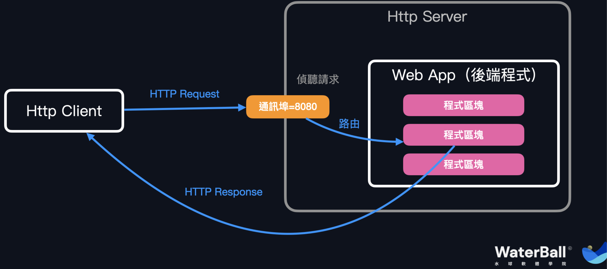
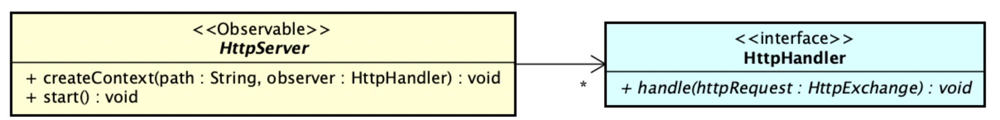

# 自幹一個 Web Framework ★★★★

## 終極副本：獨立分析、設計和實作一款 Web Framework！

## 魔王對冒險者們的喊話

各位冒險者好，我們終於來到了本課程的「終極副本」。這個副本就只有一個魔王題，也就是我—— Web Framework。在這個魔王題中，你即將打造屬於你的大型系統作品。

我並不會給你太多的拘束，我僅提供給你一份完整的需求作為「你思考的起點」，當你開發出此份需求要求的初版 Web Framework 之後，接著我會繼續帶領你在「功能/非功能設計」上自由發揮、優化或是演化，只要你持續待在旅程中，水球領主就會持續引導你去挑戰 Web Framework 更多複雜的技術細節，直到你做出一份使你非常滿意的大型作品為止。

這份作品將不屬於水球軟體學院，屬於你自己。這份作品包含你在整個過程中繪製的初版物件導向分析圖、設計圖，展現你游刃有餘思路的各組 Well-defined context，和你為每一道 problem 精準套用的設計模式——這一切都將屬於你個人，是你學有所成、是超越八成工程師實力水準的展現，是這旅程的尾聲，但同時也是你在軟體去登峰造極之路的開頭。

給自己多一點時間來享受這份題目吧，我們身為工程師，能在有生之年內去細心雕磨一款屬於自己的作品並不容易。在過去五個副本中，我要求你當一位稱職的工程師，大多數時間都在訓練你如何迎合他人的需求，並快狠準地處理各種需求。不過現在，你可以當藝術家了，Make the big thing of yours!

在開始閱讀需求之前，我想要再次提醒你一件重要的事，這份需求和以往需求相同的地方是，皆涉及了大量的領域知識，不過比較不同的地方是，這份需求涉及的是 Web 技術知識，而且這份需求更像是「技術規格文件」。所以這一題的難度是建立在「技術規格」的實作上，你個人即將扮演著一間 SI 廠商，你需要獨立分析這份技術規格文件，然後著手開發。

不過走到這裡了，又怎麼會再害怕「領域知識」呢，不管是撲克牌遊戲的知識、交友配對的知識、RPG 遊戲、醫院診斷系統的 Know-how、還是服務探索機制的架構知識和這份 Web Framework 背景知識，只要是知識，就能仰賴物件導向分析與設計的技巧，有效地在需求分析、設計和開發上 make progress。（你甚至可以當作是買了水球的軟體設計模式精通之旅後，還附送水球的 Web 知識教學。）

不瞞你說，這正是為什麼我想要以「Web Framework」作為旅程的結尾，Web Framework 涉及三大構成艱難需求的要素：

1.  Web Framework 涉及豐富無形且扎實的 Web/Http 技術背景知識。
2.  Web Framework 是許多公司後端開發賴以維生的框架，仰賴十分卓越的易用性和擴充彈性。
3.  Web Framework 的規模可大可小，只要你有耐心，你便能獨自一人開發出大規模的精緻系統。

你的初版 Web Framework 可能只有 2000 行的程式碼，但接著在新功能需求的添加下，你會再添加到 4000 行程式碼。接著再考慮「資安相關」的需求，你的框架將演化成 16000 行程式碼。16000 行其實已經算是成熟的商用套件了，如 Javascript 後端開發者常用的 express.js，也差不多位於這個行數區間。接著你肯定還會想繼續加強細節（畢竟這作品可是你引以為傲的孩子），你會開始引入各種 middleware，在架構上不斷積累至 40000 多行程式碼——不斷變強、變強，再變強。

如果你是後端工程師，那很好，在完成這副本之後，你可以聲稱你自幹過一套 Web Framework，並在各種面試場合下分享他，這已經勝過了八成的面試者。而如果你是前端工程師，那更好，你不只展現出跨領域學習的潛能，習得了後端知識，甚至還做了一件後端工程師都不太敢做的事 — 你身為前端工程師，竟然在不熟悉後端開發的情況下，就開發出 Web Framework？這太扯了。

閱讀到這裡之後，相信各位冒險者應該都已經「非常手癢」了吧。

我們開始吧！給自己弄一杯好喝的咖啡或是鮮奶茶，打開你的 UML Editor。

## 附錄： Web Framework 相關背景知識

### 附錄-1. 何謂 Web Framework?

Web Framework 顧名思義是做 Web App 的 Framework，目的是最大化開發者在開發 Web App 時的產能。Web Framework 提供了一系列的標準、API 和指導，來幫助開發者從 Web 技術細節中抽離，專注在實現企業業務需求。

不過 Web App 其實還有分「客戶端」和「伺服器端」兩端，前者又被稱之為「前端」，後者被稱之為「後端」。在此份需求中，我們的 Web Framework 面向的是伺服器端的開發。

### 附錄-2. 何謂 Web App？

Web App 指的是能在網路 (Web) 上被執行的應用程式。由於此份需求面向的是「伺服器端（以下簡稱為後端）」的開發，於是此章節此談及後端開發涉及的知識。對於 Web App 的前後端描述，有一種平易近人的說法是：前端人員負責「看得到」的部分，也就是「網頁」的實作，而後端人員負責「看不見」的部分，那便是以 HTTP 請求作為入口之後執行的所有程式邏輯，包含資料處理和各類業務流程。

在此需求中， Web App 指的都是「**後端應用程式**」，我們不討論網頁開發的部分，只討論後端程式開發。

Web App 將被部署在 HTTP Server 之上，所以你得進一步了解 Web App 與 HTTP Server 之間的關係、及其涉及的 HTTP 通訊協定之後，才能進一步了解 Web Framework 的職責範疇。

### 附錄-3. Web App 和 HTTP Server 之間的關係

1.  HTTP Server 是實踐 HTTP 通訊協定的程式（執行此程式之後，我們會說 HTTP Server 是一個常駐於背景的進程）。在執行 HTTP Server 的時候，需要為其指定一個通訊埠（Port)，在執行完 HTTP Server 程式之後，HTTP Server 便會在其所屬網路環境中「偵聽」來自於此指定通訊埠的 HTTP 請求 (HTTP Request)。
    1.  通訊埠為一個號碼，通常伺服器端的程式埠號會介於 5000~65535 之間。
2.  HTTP Server 有兩種啟動方式：
    1.  常駐背景程式的啟動方法：在作業系統中執行該 HTTP Server 程式執行檔。

    2.  嵌入式 HTTP Server：許多程式語言會內建 **HTTP Server API**，允許程式開發者直接透過物件導向程式呼叫的方式來執行 HTTP Server (Run a HTTP Server programmatically)。以下程式碼示範在 Java 中，如何啟動指定於 8080 通訊埠的 HTTP Server：

        ```
        HttpServer server = HttpServer.create(new InetSocketAddress(8080), 0);
        server.start(); // 這一行會執行 HTTP Server，開始偵聽於 8080 通訊埠的 HTTP 請求。
        ```

### 附錄-4. HTTP Server 的主要職責：偵聽請求和回應

1.  我們曾在裝飾者模式挑戰題中的背景知識小節中，提到何謂 HTTP 客戶端 (HTTP Client) 和 HTTP 請求 (HTTP Request)。

    1.  HTTP Client 透過發送 HTTP Request 來向 HTTP Server 請求相關資源，或是請求執行某一段後端程式邏輯。

    2.  更精準地來說，是前端（網頁或是手機）作為 HTTP Client，發送 HTTP Request 來向部署在 HTTP Server 上的後端程式請求資源，或是請求執行某一段後端程式邏輯。如下圖：

        

2.  可以說，HTTP Request 正是前後端主要溝通的媒介。前後端開發人員會在埋頭開發之前，先開會決議好後端欲提供的每一項 HTTP API，並說明清楚每一項 HTTP API 的預期 HTTP Request 格式，以及後端會回應的 HTTP Response 格式。最後將決議制訂於 API Document 之中供兩方人員參考。只要雙方都嚴格遵守 API Document 上制定的 HTTP Request / HTTP Response 規格做開發，便能預期雙方程式能在上線之後順利溝通。

3.  HTTP Server 的主要職責很單純，那便是偵聽於某一通訊埠的 HTTP Request，並將後端指定的回應資料，包裝成 HTTP Response 並傳遞回 HTTP Client 端。

4.  嵌入式的 HTTP Server，通常都會套用觀察者模式，允許開發者在接收新 HTTP Request 時執行特定的行為。你需要參考以下 Java 範例程式，對嵌入式 HTTP Server 的應用做多一點的想像，這會幫助你更容易了解 Web Framework 的職責。

     ```
     HttpServer httpServer = HttpServer.create(new InetSocketAddress(8080), 0);
        
     httpServer.createContext("/", new HttpHandler() {
         @Override
         public void handle(HttpExchange httpRequest) throws IOException {
             // 判斷 HTTP Request 的內容，並決定欲執行的邏輯
         }
     });
        
    httpServer.start();
    ```

    我們能夠向 HTTP Server 實體註冊 Observer （也就是 HTTPHandler 的實作），類別圖如下：
    
    

### 附錄-5. HTTP 請求與回應 (HTTP Request and Response)

目前為止我們明白了前後端是透過 HTTP Request 和 HTTP Response 來溝通，並且 HTTP Server 負責偵聽 HTTP Request 和幫忙傳遞 HTTP Response。接下來談論 Web 技術主要最複雜的環節，也就是 HTTP 通訊協定中作為主要溝通用途的兩大主體 — HTTP Request 和 HTTP Response 的定義。

我們必須詳細地理解 HTTP Request 和 HTTP Response 的格式和其中的概念，才能知道該如何在 HTTP Server 之上建構完整的 Web Framework，此 Web Framework 要盡可能支援 HTTP 協定中訂定的所有概念才行。由於此需求在初版並不會真的要求你將所有 HTTP 概念完整實作至 Web Framework 之中，所以此節只會針對需求涵蓋的範疇做相關知識的講解。

1.  HTTP Request 中依序包含三個部分：
    1.  Request Line：首先請求中會描述此次請求的 **HTTP method、URL** （也就是欲存取資源的「連結」）和 HTTP version。
        1.  HTTP Method 用來標註此次請求欲進行的「操作」種類，HTTP 協定本身雖對每一個 HTTP Method 有所規範，但通俗來說只要前後端決議清楚不同 HTTP method 代表的含義就好。HTTP Method 主要有 9 種：`GET`、`POST`、`PUT`、`PATCH`、`DELETE`、`HEAD`、`OPTIONS`、`TRACE`、`CONNECT`。其中常用來表達業務邏輯請求的為 `GET`、`POST`、`PUT`、`PATCH`、`DELETE`。
        2.  HTTP URL：為請求的指定連結，通常每一個 URL 代表著的是一項位於伺服器端的「**資源 (Resource)**」。URL 的格式為 `scheme://host:port/path?query_string`（省略了一些細節）：
            -   `scheme`: 指定此請求使用的通訊協定，如果為 HTTP 請求，則此處應填 `http` 。
            -   `host`: 指定此請求的 Domain Name 或者是 IP 位址，我們會用 Domain Name 或是 IP 位址來定位一伺服器在網際網路上的絕對位置。
            -   `port`: 指定此請求在伺服器上的通訊埠。如果不填此參數，預設會使用通訊協定本身預設的通訊埠；如果是 HTTP 協定，預設的通訊埠為 80
            -   `path`: 指定此請求欲存取資源所在階層位置。
            -   `query_string`: 此請求的「額外」查詢變數 (Query parameter)，通常用在 `GET` 請求中用來表達查詢條件，好比在 `/users?offset=10&limit=50` URL 中，有兩個查詢變數 `offset` 和 `limit` ，代表著此次請求想要查詢的是「位於第 10 筆使用者資料之後，的 50 筆使用者資料」。
        3.  HTTP Version：指定此請求使用的 HTTP 通訊協定版本。
    2.  標頭 （Headers）: 接著會包含標頭，標頭為多筆鍵值對 （Key-value pair），提供關於請求的額外資訊，好比 `user-agent` 欄位代表此請求是透過哪一套軟體代理發送（i.e., 哪一套瀏覽器）、`content-length` 欄位代表此請求主體的二進制長度、`content-type` 欄位代表此請求主體資料的資料格式（幫助 Web Framework 判讀），以及一些使用者身份的自定義欄位。
    3.  主體（Request Body）: 客戶端欲傳送給伺服器端的「資料」。通常 `POST`、`PUT` 以及 `PATCH` 請求中會需要涵蓋資料，此時客戶端就會把資料以 JSON 或是其他多媒體格式放入 Request Body 中。
2.  HTTP Response 與 HTTP Request 非常相似，皆以三個部分組成，唯一的差別在於 HTTP Response 中首先是以 Status Line 構成：
    1.  Status Line：
        1.  HTTP Version：指定此回應使用的 HTTP 通訊協定版本。
        2.  Status code：在回應中用以「表示此次請求的結果狀態」。HTTP 制定了一系列的 Status code 用以分類各種不同的結果狀態。
            1.  不同數字開頭代表不同的狀態：
                -   1xx (Informational): 表示已收到請求，伺服器器正在處理中。
                -   2xx (Successful): 表示已成功理解並正在處理請求，或是已經完整實現請求。
                -   3xx (Redirection): 表示為了完成請求，客戶端必須進行進一步的操作，比如重定向 (Redirect)。
                -   4xx (Client Error): 表示客戶端提交的請求有誤，導致伺服器無法處理。（錯在客戶）
                -   5xx (Server Error): 表示伺服器在處理請求時發生了錯誤。（錯在服務）
            2.  常用的 Status code 有以下幾種：
                -   200 OK: 表示請求成功，服務器已經完整實現了請求。
                -   201 Created: 表示請求成功，並且（強調）新的資源已經成功創建。
                -   204 No Content: 表示請求成功，但（強調）沒有返回任何內容。
                -   400 Bad Request: 表示客戶端提交的請求有誤，伺服器無法理解。
                -   401 Unauthorized: 表示此請求未經授權，需要用戶驗證身份。（必須先知道客戶的身份，接著才能考慮是否要實現請求）
                -   403 Forbidden: 表示伺服器拒絕處理請求，用戶沒有訪問資源的權限。（知道了客戶的身份之後，認為客戶無權提出此項請求）
                -   404 Not Found: 表示所請求的資源不存在。（通俗來說，代表連結有誤）
                -   405 Method Not Allowed: 表示請求方法不允許。當客戶端使用不被目標資源支援的 HTTP 方法（例如GET、POST、PUT、DELETE等）發出請求時，服務器將返回405狀態碼。這表示該資源存在於服務器上，但不支援客戶端所使用的請求方法。
                -   500 Internal Server Error: 表示服務器在處理請求時發生了內部錯誤。
    2.  標頭 （Headers）：接著涵蓋回應的標頭，與 HTTP Request 一樣，包含用以描述額外資訊的多筆鍵值對。
    3.  主體（Request Body）：與 HTTP Request 一樣，代表伺服器端欲回應給客戶端的資料。
3.  關於標頭中的 Content-type 欄位：`Content-type` 表達的是主體 (Body) 中的資料格式，以 [Media Type](https://en.wikipedia.org/wiki/Media_type) 表示。常見的 Media Type 有以下幾種，每一種表示不同的資料格式。
    1.  JSON (application/json)：JSON 格式
    2.  XML (application/xml)：XML 格式
    3.  Plain Text (text/plain)：純文字（i.e., 無限定格式）
    4.  HTML (text/html)：為一般網頁主體 HTML 格式
    5.  Form data (application/x-www-form-urlencoded)：為常見網頁提交表單時所用的格式
    6.  Multipart form data (multipart/form-data)：當主體中複合多筆子主體時使用，常見於當客戶端欲上傳多筆檔案時使用
    7.  Binary data (application/octet-stream)：純粹的二進制格式

### 附錄-6. Web Framework 的基本設計思想：控制反轉 (Inversion Of Control, IoC)

最後這一節簡短說明 Web Framework 的基本設計思想，精準來說，是藉由「控制反轉 (Inversion of Control)」來將開發者從混雜的 Web 技術細節中抽離，允許開發者專注在 Web App 的業務邏輯撰寫上。

在了解「控制反轉 (Inversion of Control)」的實質幫助之前，我們先來了解最傳統、瑣碎的命令式風格（Imperative Programming) 的寫法，也就是直接使用嵌入式 HttpServer API 時的後端程式實作方法，如下範例：

```
HttpServer httpServer = HttpServer.create(new InetSocketAddress(8080), 0);

httpServer.createContext("/", new HttpHandler() {
    @Override
    public void handle(HttpExchange httpRequest) throws IOException {
        // 判斷 HTTP Request 的內容，並決定欲執行的邏輯
                // 開發者會在這裡撰寫各式各樣的 Web App 邏輯
                switch (httpRequest.getUrl().getPath()) {
                    case "/api/users":
                        switch (httpRequest.getMethod()) {
                            case "GET":
                                List<User> users = 讀取所有 Users(); // 業務邏輯：查詢
                                HttpResponse response = 包裝成 HttpResponse(user);
                                httpRequest.respond(response); // 回應給客戶端
                            case "POST":
                                註冊新的 User(httpRequest); // 業務邏輯：註冊用戶
                                httpRequest.respond(new HttpResponse(status=202)); // 回應給客戶端
                            case "DELETE":
                                // 其他資源操作
                            ...
                        }
                        break;
                    case "/api/orders":
                        break;
                    ...
                }
                
                
    }
});

httpServer.start();
```

在此範例中，可以看見我們創建了一項 `HttpHandler` 實作物件，並將其作為 HTTP 請求的觀察者注入至 `HttpServer` 物件中。每當 `HttpServer` 偵聽到請求時，便會通知我們所實作的 `HttpHandler` 物件。於是後端開發者欲實現的 Web App 邏輯，就可以直接實作在 `HttpHandler` 實作的 `handle` 方法中，也就是開發者能在 `handle` 方法中直接決定當收到每一項 HTTP 請求時，接下來欲執行的一系列「命令」為何。

從上述程式中這一系列的「命令」便包含縝密的「路由邏輯」。好比首先先判斷 `HttpRequest` 的路徑 (Path) 為何，並將每一種路徑對應到不同的程式區塊。接著針對每一種路徑，判斷 `HttpRequest` 的 HTTP Method，來決定欲對此路徑指向的資源進行何等操作。程式中可看見，`handle` 中會偵聽 `/api/users` 和 `/api/orders` 等用戶 (User) 或訂單 (Order) 資源，並針對用戶資源，還會根據 HTTP Method 決定要執行「查詢」、「註冊」還是「刪除」操作。

其實照著這樣子的模式，開發者就能將整份 Web App 邏輯全部都撰寫在此 `HttpHandler` 實作物件中，但是有沒有覺得這份程式碼涵蓋了太多瑣碎的細節？每一次針對宣告新的伺服器資源時，就要展開好幾項曹狀的 switch cases。Web App 開發者照著命令式的撰寫風格，會把大多數的注意力放在處理 HTTP 協定、資料格式和路由的瑣碎邏輯上，便無法將重心放在對企業最重要的「業務邏輯」之中，好比登入、註冊等會員服務功能。這便本末倒置了。

所以我們提出的解決方案是什麼？—— 那就是**剝奪開發者對於流程的控制權**。

在上述命令式風格的撰寫內容中，大多數時間下開發者都是在描述「**完整 HTTP Request to Response 的控制流程**」，要求開發者完整地控制此流程是一件非常耗費產能的事。為了在我們所設計的 Web Framework 中大幅提高開發者的產能，Web Framework 應該要把「流程的控制權」反轉一下：「讓 Web Framework 來控制 HTTP Request to Response 的流程，開發者只需要告訴框架說，『什麼時候』要呼叫開發者的『什麼』程式區塊就行了。」——這就是控制反轉 (Inversion of Control) 的本意。

一項簡單的「控制反轉」過後的 Web App 程式碼，會長得像如下的 Java 程式（以 Java 中最知名的 Web Framework — Spring Framework 作為示範）：

```Java
@RestController
@RequestMapping("/books")
public class BookController {

    private final BookService bookService;

    public BookController(BookService bookService) {
        this.bookService = bookService;
    }

    @PostMapping
    public ResponseEntity<BookView> createBook(@RequestBody CreateBookRequest request) {
        Book book = new Book(request.getTitle(), request.getAuthor());
        bookService.createBook(book);
        BookView bookView = convertToView(book);
        return ResponseEntity.status(HttpStatus.CREATED).body(bookView);
    }

    @GetMapping("/{id}")
    public BookView getBook(@PathVariable("id") Long id) {
        Book book = bookService.getBookById(id);
        if (book == null) {
            return ResponseEntity.notFound().build();
        }
        BookView bookView = convertToView(book);
        return bookView;
    }
}
```

這段程式碼用於處理「書籍 (Book) 資源」的相關 HTTP 請求。首先透過 `@RequestMapping("/books")`註解來指定 `BookController` 負責的是位於路徑 `/books`下的所有處理請求。`BookController` 定義了兩個 API Endpoints：

1.  `[POST] /books` 宣告於 `createBook`方法，用於新增一本新書。
    -   接收一個請求主體 (Request body) 為 `CreateBookRequest` 型別的物件，其中包含書籍的標題和作者。
    -   呼叫 `BookService` 的 `createBook` 方法，將該書籍新增到系統中。
    -   將新增的書籍轉換為 `BookView` 物件，並以 HTTP 回應狀態碼 201 Created 給客戶端。
2.  `GET /books/{id}` 宣告於 `getBook`方法，用於取得特定 id 的書籍資源。
    -   接收一個路徑變數 (id) 作為參數，代表要查詢的書籍 id。
    -   呼叫 `BookService` 的 `getBookById` 方法，根據提供的 id 來查詢相應的書籍。
    -   如果找不到該 id 對應的書籍，則回傳 HTTP 回應狀態碼 404 Not Found 給客戶端。
    -   如果成功找到書籍，則將書籍轉換為 `BookView` 物件，並將該物件回傳給客戶端。

在上述程式中，唯一和 HTTP 技術有關的部分只有 `@RestController`, `@RequestMapping("/books")`, `@PostMapping`, `@GetMapping("/{id}")`, `@RequestBody` 和 `@PathVariable` 等註解。只要透過這些註解輕描淡寫，就能將路由等流程控制權交給 Web Framework，而開發者只專注在業務邏輯上。不過這份程式中所展現的簡潔，實際上大量仰賴著程式語言的特性，不同程式語言有著不同的特性，導致了不同的控制反轉實作能力。本題目刻意避開了這個問題，我們只會先要求你透過最基本的物件導向語法來設計 Web Framework，若你在完成初版實作後仍心有餘力，你可以善用語言特性來提升 Web Framework 的易用性。

## Web Framework 需求摘要

你需要開發一款 Web Framework，這款 Web Framework 他能夠允許開發者用「最少」且「最有表達力」的程式碼，來做到以下幾件事情：

1.  **路由機制 \[B\]**：Web Framework 能判讀 HTTP 請求，並根據請求中路徑及其內容決定欲呼叫對應的程式區塊，此程式區塊又被稱之為 **Handler Method**。執行完 Handler Method 之後，會將 Handler Method 的回傳值透過序列化機制 \[C\] 來建立 HTTP 回應，並傳回給客戶端。
2.  **序列化/解序列化機制 \[C\]**：自動化將 HTTP Request Body 解序列化成物件，或者是將物件序列化成 HTTP Response Body 的能力。於是開發者不必深入了解 HTTP Request / Response Body 的格式處理細節。
3.  **異常處理機制 \[D\]**：在客戶非法請求或是後端程式拋出例外時，仍能適當處理，或是以適當 HTTP Status code 展示請求結果且不影響伺服器持續運作的能力。
4.  **擴充性考量 \[E\]**：Web Framework 在路由、序列化/解序列化、異常處理等機制的實作上，需要支援非常強勁的擴充性，以便於在未來支援各類 Web App 情境時，仍然在不修改 Web Framework 核心原始碼的情況下，透過擴充新的插件來支援新情境。
5.  **IoC 容器設計 \[F\]**：如 \[附錄-6\] 小節所說，Web Framework 設計須做到「控制反轉」來提升程式品質。不過「控制反轉」其實有一項關鍵的衍生設計議題：物件生命週期的管理。你需要實作 IoC 容器來完整r實現控制反轉。

## A. Web App 需求情境展示：

此章節描述你需要實現的 Web App 規格，由多項使用案例組成，而每一項使用案例中會描述其流程和對應的 HTTP API Document \[附錄-4.2\]。

### A0. 情境摘要

你要開發一個簡易的**會員系統**，使用者透過在會員系統上輸入個人資料、郵件和密碼來註冊會員身份，註冊完會員身份之後，則可以透過輸入郵件帳號和密碼來登入，並進行額外會員專屬的操作。

### A1. 會員註冊 (User registration)

1.  流程：
    1.  使用者提供以下資料來註冊 (Register) 會員身份 \[R1\]：
        1.  郵件 (Email)：必須為郵件格式，字數限制 4~32。不能與已註冊的會員所擁有的郵件重複。
        2.  名稱 (Name)：字數限制 5~32。
        3.  密碼 (Password)：字數限制 5~32。
    2.  後端驗證註冊資料：
        1.  在以下兩種情況下，此請求會被視為不合法的請求。後端根據不同情況做出不同回應：
            1.  郵件已存在 (Email Duplication) \[R3\]：該筆註冊郵件與現存會員的郵件重複。
            2.  資料格式不正確（超出字數限制，或是註冊的郵件不遵守郵件格式）\[R4\]
        2.  如果請求合法則成功註冊。則首先先為這筆新的會員資料創建其會員編號，並回傳成功註冊的會員資料 \[R2\]：
            1.  會員編號 (Id)：該會員的流水號，從 1 開始算起，如果此系統中目前存在 3 位會員，則在此時註冊會員的話會獲得會員編號 4。
            2.  郵件和名稱則為使用者在註冊時提供的郵件和名稱。
2.  API Document
    1.  使用者註冊 \[R1\] — HTTP Request
        1.  HTTP Headers:

            -   `content-type`: `application/json`
        2.  HTTP Method: `POST`

        3.  HTTP Path: `/api/users`

        4.  Request Body:

            ```
            {
              "email": "會員郵件",
              "name": "會員名稱",
              "password": "會員密碼",
            }
            ```

        5.  成功註冊 \[R2\] — HTTP Response
            
            1.  HTTP Status Code: `200`
                
            2.  HTTP Headers:
                
                -   `content-type`: `application/json`
                -   `content-encoding`: `UTF-8`
            3.  Response Body:
                
                ```
                {
                  "id": "會員編號",
                  "email": "會員郵件",
                  "name": "會員名稱",
                }
                ```
                
        6.  註冊失敗案例 1（郵件已存在）\[R3\]：
            
            1.  HTTP Status Code: `400`
                
            2.  HTTP Headers:
                
                -   `content-type`: `plain/text`
                -   `content-encoding`: `UTF-8`
            3.  Request Body:
                
                ```
                Duplicate email
                ```
                
        7.  註冊失敗案例 2（資料格式不正確）\[R4\]：
            
            1.  HTTP Status Code: `400`
                
            2.  HTTP Headers:
                
                -   `content-type`: `plain/text`
                -   `content-encoding`: `UTF-8`
            3.  Response Body:
                
                ```
                Registration's format incorrect.
                ```

### A2. 會員登入 (User Login)

1.  流程：
    1.  使用者提供以下資料來登入 (Login) \[R1\]：
        1.  郵件 (Email)：必須為郵件格式，字數限制 4~32。
        2.  密碼 (Password)：字數限制 5~32。
    2.  後端驗證登入資料：
        1.  在以下兩種情況下，此請求會被視為不合法的請求。後端根據不同情況做出不同回應：
            1.  找不到相同郵件和密碼的會員 (Credentials Invalid) \[R3\]
            2.  資料格式不正確（超出字數限制，或是登入的郵件不遵守郵件格式）\[R4\]
        2.  若能找出相同郵件和密碼的會員，則判定為登入成功且回傳該會員資料 \[R2\]：
            1.  會員編號 (Id)：該會員在註冊時便決定好的編號。
            2.  郵件和名稱則為使用者在註冊時提供的郵件和名稱。
            3.  **身份權杖 (Token)**：後端隨機生出一組 36~60 字數的亂碼字串（必須保證在不同時間點會產生出絕對不同且不會重複的字串，可使用 UUID 相關套件），此份亂碼字串作為該會員的身份權杖，未來每當使用者在送出 HTTP 請求時，在標頭中帶上這個權杖，就能透過權杖向後端展現其會員的身份，並享有該會員的特殊權限。
2.  API Document
    1.  使用者登入 \[R1\] — HTTP Request
        1.  HTTP Headers:

            -   `content-type`: `application/json`
        2.  HTTP Method: `POST`

        3.  HTTP Path: `/api/users/login`

        4.  Request Body:

            ```
            {
              "email": "會員郵件",
              "password": "會員密碼",
            }
            ```

        5.  成功登入 \[R2\] — HTTP Response
            
            1.  HTTP Status Code: `200`
                
            2.  HTTP Headers:
                
                -   `content-type`: `application/json`
                -   `content-encoding`: `UTF-8`
            3.  Response Body:
                
                ```
                {
                  "id": "會員編號",
                  "email": "會員郵件",
                  "name": "會員名稱",
                  "token": "67cbbe1b-0c10-46e4-b4a8-9e8505c2453b" // 會員的權杖範例
                }
                ``` 
                
        6.  登入失敗案例 1（找不到相同郵件和密碼的會員）\[R3\]：
            
            1.  HTTP Status Code: `400`
                
            2.  HTTP Headers:
                
                -   `content-type`: `plain/text`
                -   `content-encoding`: `UTF-8`
            3.  Request Body:
                
                ```
                Credentials invalid
                ``` 
                
        7.  登入失敗案例 2（資料格式不正確）\[R4\]：
            
            1.  HTTP Status Code: `400`
                
            2.  HTTP Headers:
                
                -   `content-type`: `plain/text`
                -   `content-encoding`: `UTF-8`
            3.  Response Body:
                
                ```
                Login's format incorrect.
                ```

### A3. 會員修改名稱 (User Rename)

1.  流程：
    1.  使用者欲提供以下資料來修改會員名稱 \[R1\]：
        1.  名稱 (Name)：字數限制 5~32。
    2.  後端首先做身份驗證，解析請求標頭中的身份權杖：
        1.  如果此為權杖的格式不正確，導致後端無法正確解析，則視為身份驗證失敗，回傳 \[R2\]。
        2.  如果後端能成功解析此身份權杖所展現的會員身份，但此請求提出修改的會員對象為其他用戶，由於你無權修改其他會員的名稱，回傳 \[R3\]。
    3.  後端驗證修改名稱資料：
        1.  如果名稱的長度不正確，則回傳 \[R5\]
        2.  找到此會員，並成功修改其名稱，回傳 \[R4\]。
2.  API Document
    1.  使用者欲修改名稱 \[R1\] — HTTP Request
        1.  HTTP Headers:

            -   `content-type`: `application/json`
            -   身份權杖 (token) 透過 header 攜帶：
                -   `Authorization`: `Bearer <token>` （欄位名稱為 Authorization，值的部分首先先填入 Bearer，接著隔一個空白，再填入身份權杖的字串）
        2.  HTTP Method: `PATCH`

        3.  HTTP Path: `/api/users/{userId}`

            -   將該會員的編號作為路徑變數 (Path Variable)，填入路徑中的 `{userId}` 段落。如果此使用者的會員編號為 3，則修改名稱請求的路徑為：`/api/users/3`。
        4.  Request Body:

            ```
            {
              "newName": "欲修改的新名稱"
            }
            ```

        5.  此為不合法的身份權杖（權杖格式不正確） \[R2\] — HTTP Response
            
            1.  HTTP Status Code: `401`
                
            2.  HTTP Headers:
                
                -   `content-type`: `plain/text`
                -   `content-encoding`: `UTF-8`
            3.  Response Body:
                
                ```
                Can't authenticate who you are.
                ```
                
        6.  無權修改其他人的名稱 \[R3\] — HTTP Response
            
            1.  HTTP Status Code: `403`
                
            2.  HTTP Headers:
                
                -   `content-type`: `plain/text`
                -   `content-encoding`: `UTF-8`
            3.  Response Body:
                
                ```
                Forbidden
                ```
                
        7.  成功修改名稱 \[R4\] — HTTP Response
            
            1.  HTTP Status Code: `204`
            2.  HTTP Headers 中不存在 `content-type` 和 `content-encoding` ，並且也沒有 Response Body。
        8.  名稱的長度不正確 \[R5\] — HTTP Response
            
            1.  HTTP Status Code: `400`
                
            2.  HTTP Headers:
                
                -   `content-type`: `plain/text`
                -   `content-encoding`: `UTF-8`
            3.  Response Body:
                
                ```
                Name's format invalid.
                ```

### A4. 用名稱關鍵字來查詢會員 (User Query)

1.  流程
    1.  使用者欲查詢會員 \[R1\]，提供以下資料：
        1.  查詢關鍵字 (keyword)：為一字串，非必要參數
    2.  後端驗證此請求者是否來自於一「會員」，意即此請求須攜帶合法的會員權杖，否則無權查詢，中斷操作 \[R2\]。
    3.  後端回傳篩選後的會員列表作為查詢結果 \[R3\]
        1.  如果使用者沒有提供此查詢關鍵字，則回傳所有會員。
        2.  如果使用者有提供此查詢關鍵字，則回傳所有會員中，名稱包含此關鍵字的會員。
2.  API Document
    1.  使用者欲查詢會員 \[R1\] — HTTP Request
        1.  HTTP Headers:

            -   身份權杖 (token) 透過 header 攜帶：
                -   `Authorization`: `Bearer <token>` （欄位名稱為 Authorization，值的部分首先先填入 Bearer，接著隔一個空白，再填入身份權杖的字串）
        2.  HTTP Method: `GET`

        3.  HTTP Path: `/api/users`

        4.  HTTP 查詢變數 (Query Parameter)：`keyword` 為一字串

            -   舉例來說，如果此使用者欲查詢的關鍵字為 `johnny` ，則此請求的路徑為`/api/users?keyword=johnny`
        5.  Request Body: 無需提供

        6.  此為不合法的身份權杖（權杖格式不正確） \[R2\] — HTTP Response

            1.  HTTP Status Code: `401`

            2.  HTTP Headers:

                -   `content-type`: `plain/text`
                -   `content-encoding`: `UTF-8`
            3.  Response Body:
                
                ```
                Can't authenticate who you are.
                ```

        7.  回傳篩選後的會員列表作為查詢結果 \[R3\] — HTTP Response
            
            1.  HTTP Status Code: `200`
                
            2.  HTTP Headers:
                
                -   `content-type`: `application/json`
                -   `content-encoding`: `UTF-8`
            3.  Response Body:
                
                ```
                [
                  {
                    "id": "第 0 位會員的編號", 
                    "email": "第 0 位會員的郵件", 
                    "name": "第 0 位會員的姓名", 
                  }, 
                  {
                    "id": "第 1 位會員的編號", 
                    "email": "第 1 位會員的郵件", 
                    "name": "第 1 位會員的姓名", 
                  }, 
                  ... // 以此類推，列入每一位會員在 JSON 陣列中
                ]
                ```

在初版需求中，僅需要以此四項使用案例作為雛形即可，你可以自由添加任何你認為有助於你展現雛形的使用案例。

## B. Routing 路由機制 (HTTP to Handler)

此章節以 \[A\] 章節所描述的情境作為範例，並描述你所設計的 Web Framework 大致上需要提供何等「路由機制」，來允許 Web App 開發者輕鬆在 Http Server 上串接他所寫的物件導向程式。

由於 HTTP Server API 本身的職責包含偵聽 HTTP 請求，開發者只需要做兩件事：(1) 以物件導向程式設計來實現業務邏輯 (2) 將 HTTP 請求映射到對應的物件方法上。如此一來，每當有新的 HTTP 請求時，就能委派給對應的物件方法來執行邏輯，並將該物件方法的回傳值，作為 HTTP 回應的主體 (Response Body) 即可。

舉例來說，以 \[A\] 章節所描述的情境作為範例，開發者可能會宣告一個 `UserController` 類別，此類別負責所有與會員相關的功能。在`UserController`中以四個方法分別實現會員的登入、註冊、重新命名和查詢功能，如下：

```
class UserController {
    private Map<String, User> emailToUser = new HashMap<>(); // 用來存所有會員資料

    public LoginResponse login(HttpRequest request) {
        LoginRequest request = request.readBodyAsObject(LoginRequest.class);
        var email = request.getEmail();
        var password = request.getPassword();
        // 查詢此會員是否存在 
        if (users.containsKey(email)) {
        User user = users.get(email);
            if (password.equals(user.getPassword())) {
                return new LoginResponse(user.getId(), user.getName(), user.getEmail());
            }
        }
        throw new InvalidCredentialsException("Credentials Invalid");
    }

    public static class LoginRequest {
       private String email;
       private String password;
       //... constructors, getters
       // 在建構子中驗證資料格式是否正確，否則拋出例外。
  }

    public static class LoginResponse {
        private int id;
        private String email;
        private String name;
        //... constructors, getters
    }

    public RegisterResponse register(HttpRequest request) {
        // ... 註冊的業務邏輯
    }

    ... // 其他方法

}
```

此 `UserController` 又可被稱之為 **Handler（以下皆會以 Handler 來稱呼所有 Web Framework 的路由對象）**。 Http Request Handler 類別中的每一個方法皆會接收一個 `HttpRequest` 型別的參數，此 `HttpRequest` 提供一系列方法，方便開發者取得此次 HTTP 請求中的所有資料（如章節 \[0-2\] 所述的所有 HTTP 請求資訊）。

### B1. HttpRequest 介面設計

-   好比 `HttpRequest` 類別可能包含以下方法：
    1.  `readBodyAsObject(type: Class<T>): T`: 讀取 HTTP Request body，並解序列化轉成某型別。（請參考序列化/解序列化機制 \[C\]）
    2.  `getHeader(key: String): String` ：獲得此 HTTP Headers 中的 `key` 名稱對應的欄位。好比 `key` 可能為 `content-type` 或是 `content-encoding` 。
    3.  `getHttpMethod(): HttpMethod` ：獲得此 HTTP 請求的 HTTP method。
    4.  此外，HttpRequest 也可能會提供一個方便的方法，來幫助開發者獲得此次請求的某段路徑變數 (Path Variable)，或是查詢變數 (Query Variable)。

### B2. 將 HTTP 請求路由到各個 Handler Method

宣告完 UserController 之後，接下來再透過某種物件導向的語法，來將 HTTP 請求路由到 UserController 的各個方法上。好比以下虛擬程式碼所述：

```
WebApplication webApp = new WebApplication(port=8080); 
Router router = webApp.getRouter();  // Router 為你所設計的 Web Framework 中負責路由的類別
UserController userController = new UserController(/* ...依賴注入所需參數 */);

// 做路由綁定
router.post("/api/users", userController::register);
router.post("/api/users/login", userController::login);
router.patch("/api/users/{userId}", userController::rename);
router.get("/api/users", userController::queryUsers);
```

我們會稱所有經過 Router 路由的委派方法為 Handler Method，UserController 具備四個 Handler Methods (register, login, rename 和 queryUsers)。

此份虛擬程式碼做了以下幾件事：

1.  創建 HttpServer，並決定要偵聽的 port 為 8080。
2.  創建自定義框架中的 `Router` 物件和 Web App 中所需的 `UserController` 物件。
3.  向 `Router` 物件註冊四筆路由設定：
    1.  HTTP 請求：`[POST] /api/users` ，將被匹配到 `UserController` 物件的 register 方法。
    2.  HTTP 請求：`[POST] /api/users/login` ，將被匹配到 `UserController` 物件的 login 方法。
    3.  HTTP 請求：`[PATCH] /api/users/{userId}` ，將被匹配到 `UserController` 物件的 rename 方法。
    4.  HTTP 請求：`[GET] /api/users` ，將被匹配到 `UserController` 物件的 queryUsers 方法。

如此一來，當有一會員登入請求 `[POST] /api/users/login` ，程式會執行以下流程：

1.  `HttpServer` 通知我們有一則新的 HTTP 請求。
2.  `Router` 將此筆請求包成我們自定義的 `HttpRequest` 物件。
3.  `Router` 透過路由找到了此筆請求對應的 `UserController` 物件的 `login` 方法。
4.  `Router` 將 `HttpRequest` 傳入 `UserController` 的 `login` 方法中執行。
5.  `UserController` 的 login 方法執行完畢，此時可能有兩種結果：
    1.  `login` 方法拋出例外：此時 `Router` 會遵循某種「異常處理 \[D\]」機制，來決定適當的 HTTP Response。
    2.  `login` 方法正常結束，回傳 `LoginResponse` 物件：此時 `Router` 遵循「序列化/解序列化機制 \[C\]」，參考此路由訂定的 `content-type` ，並將 `LoginResponse` 序列化成對應 `content-type` 所需格式。好比開發者可能會透過某種方式將 `UserController` 的所有回應，配置成 `application/json` `content-type` 格式，於是 Router 會將 `LoginResponse` 序列化成 json 字串。

## C. 序列化 / 解序列化機制

此章節針對 Web Framework 設計中，針對 HTTP Response Body 和 HTTP Request Body 提供的「序列化/解序列化」機制。

在章節 \[B1\] 中的 HttpRequest 介面設計中，我們提到了 HttpRequest 介面可以提供`readBodyAsObject(type: Class<T>): T` 方法，來讀取 HTTP Request body，並將其解序列化成某型別物件。在此範例中，我們傳入了 `type` 至 `readBodyAsObject` 方法中，來指定欲解序列化的目標型別。

這裡簡單定義一下何謂「序列化/解序列化」，序列化的意思是將一物件轉成能透過網路傳遞的「字串」或是「二進制陣列」；而解序列化的意思就是將一「字串」或是「二進制陣列」，轉回某一指定型別的物件。好比以下例子：

1.  假設開發者宣告了一 `RegisterRequest` 類別如下：

    ```
    public static class RegisterRequest {
        private String email;
        private String name;
        private String password;
        // constructors, setters, getters, ..
    }
    ```

2.  而此時，我們偵聽到一 HTTP 請求，且其 HTTP Request Body 如下：

    ```
    {
      "email": "johnny@waterballsa.tw", 
      "name": "水球", 
      "password": "MyNameIsJohnny123", 
    }
    ```

3.  並且開發者宣告了以下 Handler Method 作為路由匹配對象：

    ```
    public UserResponse register(HttpRequest request) {
        RegisterRequest req = request.readBodyAsObject(RegisterRequest.class);
        // ... 執行註冊業務邏輯
    }
    ```

4.  在執行 `request.readBodyAsObject(RegisterRequest.class)` 這一行時，`HttpRequest` 介面的實作會執行以下流程：

    1.  首先會先參考此 HTTP 請求 Headers 中的 `content-type` 欄位 \[附錄-5\]，根據此欄位的值來辨別 Request Body 中所用的格式，並分別為每一種格式提供一種解序列化方式。
        1.  好比若此 HTTP 請求 Headers 中的 `content-type` 欄位為 `application/json` ，則會透過第三方 Json 套件來去解析 HTTP Request Body 中 JSON 格式的字串，將字串解序列化成 `RegisterRequest.class` 型別。
        2.  而若此 HTTP 請求 Headers 中的 `content-type` 欄位為 `application/xml` ，則會透過第三方 XML 套件來去解析 HTTP Request Body 中 XML 格式的字串，將字串解序列化成 `RegisterRequest.class` 型別。
        3.  以此類推，Web Framework 中能支援越多格式越好。如果遇到尚未支援的 `content-type` 格式，則此時會拋出例外，中斷請求。（請見章節 \[D\]，此時應該拋出 500 HTTP Status Code 表示例外)
5.  而當此 Handler Method 執行結束後，Handler Method 會回傳一 `UserResponse` 型別的物件作為回應。此時 Web Framework 會執行以下流程來結束此次 HTTP 請求：

    1.  參考此 Handler Method 的配置，其中一項配置是「此 Handler Method」在回應時欲指定的 `content-type` 。好比次此 `register` Handler method 可以透過指定其 `content-type` 為 `application/json` 說，來要求以 JSON 格式來序列化其回應的 `UserResponse` 物件。其他 `content-type` 格式也是用，如 `application/xml` 。
        1.  如果此 Handler Method 指定的 `content-type` 未被支援，則此時會拋出例外，中斷請求。（請見章節 \[D\]，此時拋出 500 HTTP Status Code 表示例外)

此等序列化/解序列化在各大 Web Framework 中非常方便，如此一來，就能夠幫助開發者處理繁雜的 HTTP 資料格式細節。

## D. 異常處理機制

此章節針對所有可能在「路由階段」中的「非法請求」或是「執行期例外」，訂定對應的異常處理行為。

1.  找不到此筆 HTTP 請求對應的 Handler Method — 回應以下 Http Response：

    1.  HTTP Status Code: `404`

    2.  HTTP Headers:

        -   `content-type`: `plain/text`
        -   `content-encoding`: `UTF-8`
    3.  Response Body:

        ```
        Cannot find the path "<path>"
        ```

    4.  Response Body（舉例）：當 Client 發出 `/api/notfound` 請求，但 Web App 中不存在此路由，所以此時回傳的 Response Body 為：
        
        ```
        Cannot find the path "/api/notfound"
        ```

2.  若此筆 HTTP 請求可匹配到路由中的路徑，但是請求指定的 HTTP Method 不匹配此路徑在路由中的路徑 — 回應以下 Http Response：

    1.  HTTP Status Code: `405`

    2.  HTTP Headers:

        -   `content-type`: `plain/text`
        -   `content-encoding`: `UTF-8`
    3.  Response Body:

        ```
        The method "<method>" is not allowed on "<path>"
        ```

    4.  Response Body（舉例）：當路由中有一筆 `[POST] /api/users → userController::register` ，而 Client 發出 `[DELETE] /api/users` 請求，此時回傳的 Response Body 為：
        
        ```
        The method "DELETE" is not allowed on the path "/api/users"
        ```

3.  當 Handler method 在執行的過程中拋出了例外：

    1.  預設的情況下會回傳以下 HTTP Response：

        1.  HTTP Status Code: `500`

        2.  HTTP Headers:

            -   `content-type`: `plain/text`
            -   `content-encoding`: `UTF-8`
        3.  Response Body: Body 中只存放該例外的錯誤訊息。

            ```
            <Exception's message>
            ```

    2.  Web App 開發者，可以針對各種例外情境，來訂定特殊的回傳方式，來覆寫預設的 500 HTTP Response，請參考擴充性考量\[E\]。

4.  如果你的程式語言不支援「例外處理」機制（好比 Go)，Handler method 必須在回傳值表達錯誤情況，則將設計改變成以下形式：

    1.  Handler method 透過回傳值表達錯誤情況
    2.  Web Framework 會解讀 Handler method 的回傳值，如果錯誤發生則執行上述預設處理規則。

## E. 擴充性考量

1.  Web Framework 在路由、序列化/解序列化、異常處理等機制的實作上，需要支援非常強勁的擴充性，以便於在未來支援各類 Web App 情境時，仍然在不修改 Web Framework 核心原始碼的情況下，透過擴充新的插件來支援新情境。
2.  針對序列化/解序列化機制 \[C\]，你需要以「插件」形式支援各類 HTTP Request / Response Body Media type （參考自標頭的`content-type` \[附錄-5, C\]） 的序列化/解序列化。內建初始支援 `application/json` 、`plain/text` 和各種多媒體檔案等 Media-type。而 Web Framework 初版只提供 `application/xml` Media type 的插件。
    1.  舉例來說，若開發者想在 Web App 中啟動對 `application/xml` Media type 的支援，則只需要在 Web Framework 的啟動程式中增加插件配置就行了，如下：

        ```
        WebApplication app = new WebApplication(port=8080);
        ...
        app.addPlugin(new XmlMediaTypePlugin()); 
        ...
        app.launch();
        ```

        此份程式假設 Web Framework 的物件進入點為 `WebApplication` 類別，開發只透過向 `WebApplication` 物件註冊 `XmlMediaTypePlugin` 插件，來支援 `application/xml` 的序列化/解序列化機制。
        
    2.  並且也要允許開發者自行開發插件，在擴充新序列化/解序列化機制時，Web App 開發者不必修改 Web Framework 的內部程式碼。

3.  針對異常處理機制 \[D\]，Web Framework 預設提供了一組異常處理的情境，如章節 \[D\] 所說。不過 Web Framework 要允許 Web App 開發者能夠在不修改 Web Framework 內部程式碼的前提下，任意擴充新的異常處理機制，或是支援新的例外與 HTTP Status code 的轉換規則。
    1.  好比允許開發者可以配置如下：當 Handler Method 拋出 `IncorrectCredentialsException` 例外時，會自動將此例外翻譯成狀態碼 400 的 HTTP 回應，並且回應主體自動填入此例外的錯誤訊息。

## F. IoC 容器設計

### F1. 議題探討

如 \[附錄-6\] 小節所說，Web Framework 設計須做到「控制反轉」來提升程式品質。控制反轉 (Inversion of Control, IoC) 指的是 \[附錄-6\] 讓 Web Framework 控制 HTTP Request to Response 的流程。這件事聽起來簡單，但在實作上有一項重要的衍生設計議題須要考量：當整個流程中所依賴的物件有「生命週期」上的限制時該怎麼辦？

由以下這段程式碼作為範例例（衍生至 \[B\] 的範例程式）：

```
class UserController {
    private UserService userService; // 這個物件負責會員相關業務邏輯
    
    public UserController(UserService userService) {
        this.userService = userService;
    }

    public LoginResponse login(HttpRequest request) {
        LoginRequest request = request.readBodyAsObject(LoginRequest.class);
        return userService.login(request); // 委派給此物件
    }
... // 其他方法
}

// Web App 程式執行入口
public static void main(String[] args) {
    WebApplication webApp = new WebApplication(port=8080); 
    Router router = webApp.getRouter();  // Router 為你所設計的 Web Framework 中負責路由的類別
    UserController userController = new UserController(new UserService());
    
    // 做路由綁定
    router.post("/api/users/login", userController::login);
    ...
}
```

`UserController` 為一 Handler 類別，其依賴著 `UserService` 物件來實現業務邏輯。`UserController` 類別專注在描繪業務邏輯。從程式執行入口中可見，我們首先創建了 `UserController` 並依賴注入 `UserService` 實體給 `UserController` ，那麼——如果我們在 `UserService` 的生命週期上添加限制，則會有衍生問題。

好比在代理人模式影片中提到的「延遲載入 (Lazy Loading)」，如果我們希望 `UserService`物件只在 `UserController` 真正第一次接收到請求後，才被創建出來，那麼該怎麼辦呢？就沒辦法在創建 `UserController` 時依賴注入 `UserService` 實體了。

此情境下，唯一知道「何時要創建出 `UserService` 物件」的是 Web Framework，也就是說，必須是由 Web Framework 來管理每一個依賴物件的生命週期。在控制反轉的設計下，我們會稱這種，負責管理依賴物件生命週期，並且會在最適當時機將依賴物件創建出來的容器，為「控制反轉容器 (IoC Container)」。

### F2. IoC 容器設計需求

1.  綜上所述，你需要設計一種控制反轉的容器，容器提供了一些操作，允許開發人員做到以下幾件事：

    1.  能透過類似於 `container.registerType(”userController”, UserController.class)` 的語法向此容器註冊依賴（依賴名稱為 `userController`，而依賴的實際型別為 `UserController.class`。
    2.  能透過類似於 `controller = (UserController) container.get(”userController”)` 或是 `controller = container.get(UserController.class)` 的語法來向容器取得某一具名依賴實體。
2.  呈上，此容器在「生命週期」的設定上，須考量優秀的擴充性，以下為舉例：

    1.  預設的依賴生命週期可能是「**單體 (Singleton)**」，單體依賴在整份程式的執行期間只會存在一份。好比，如果你將 `UserController` 依賴設定為單體生命週期，那無論你呼叫多少次 `container.get(UserController.class)` ，`UserController` 僅會在第一次所需時被創建出來，接下來每一次向容器存取 `UserController` 依賴時，容器皆會返回同一份實體。

    2.  除了單體之外，容器還提供了「**雛形 (Prototype)**」生命週期（或是任何其他你喜歡的命名）。如果你將`UserController` 依賴設定為雛形生命週期，那在你每一次呼叫 `container.get(UserController.class)` 時，容器都會創建且返回一個全新的 `UserController` 實體。

    3.  除了單體和雛形兩種生命週期之外，你需要允許開發者能夠自行擴充新種類的生命週期至容器中，並且無需修改容器的內部程式碼。舉例來說，你所設計的 Web Framework 可能會想要擴充一種新的 「HTTP 請求」生命週期給 Web App 開發者使用，如果你將 `UserService` 依賴設定為HTTP 請求生命週期，那透過某種方式，你可以確定在「每一次接收到新的 HTTP 請求」時，容器皆會創建出一份新的 `UserService`實體。

    4.  開發者能夠自主配置不同的生命週期到不同的依賴上，以下為範例程式碼：

        ```
        container.register(UserController.class) // 預設：單體生命週期
        container.register(UserService.class, new PrototypeScope()) // 使用雛形生命週期
        container.register(DatabaseConnection.class, new HttpRequestScope()) // 使用 HTTP 請求生命週期
        container.register(BookController.class) // 預設：單體生命週期
        container.register(BookService.class, new HttpRequestScope()) // 使用 HTTP 請求生命週期
        ```

3.  你所設計的 Web Framework，會善用你所設計的 IoC Container 來管理所有 Handler 依賴，以及衍生依賴的生命週期，並藉此更高效率地控制 HTTP Request to Response 流程。


## 設計指導

1.  你可以使用任何你認為更「簡潔」或是更有「易用性」的設計，來取代上述此份需求中提及的任何範例程式。
2.  你可以自由添加任何你在設計過程中所察覺到的 Forces（e.g., 某種擴充性上的考量），不過在套用任何設計或是設計模式時，皆必須要在 OOAD 設計稿上留下 Well-Defined Context（i.e., what forces you; what’s the problem)。
